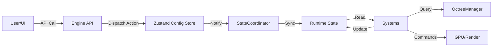
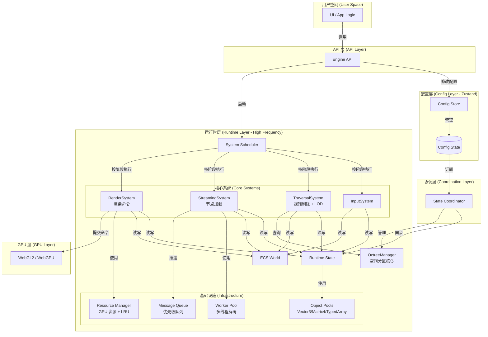
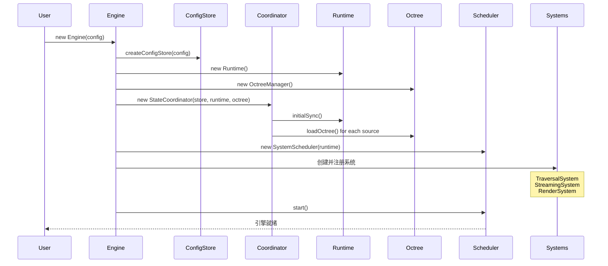
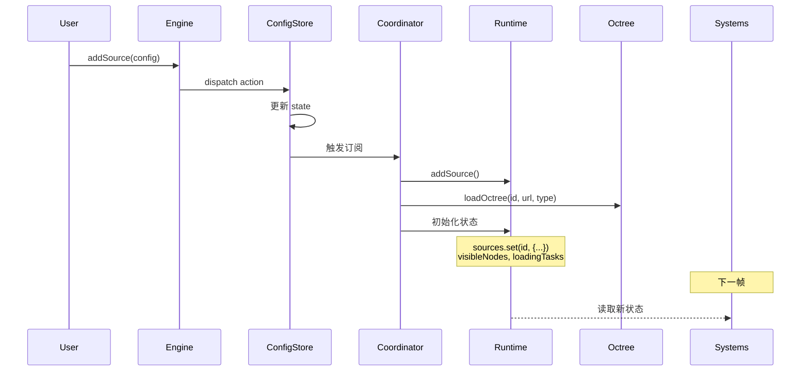
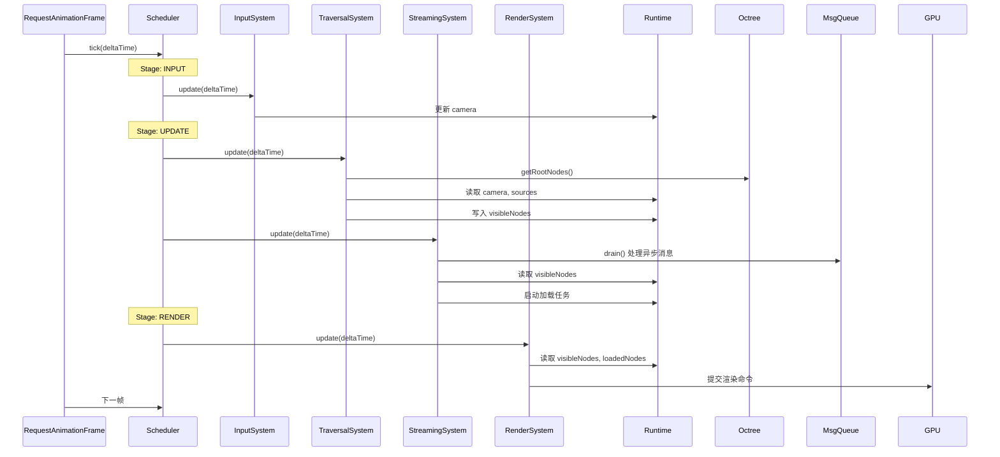
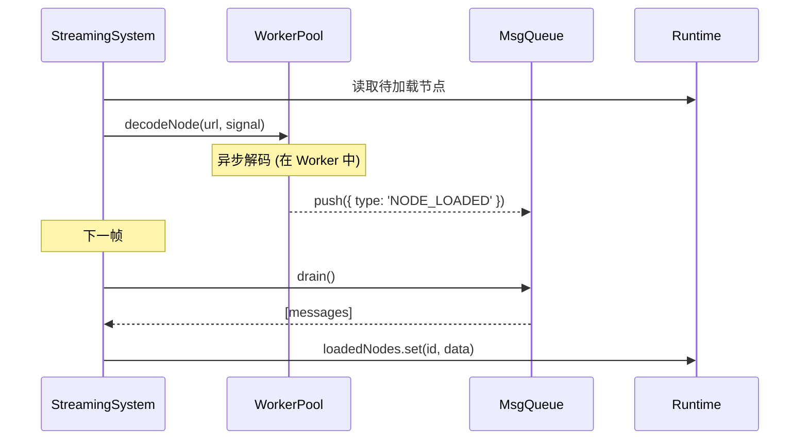
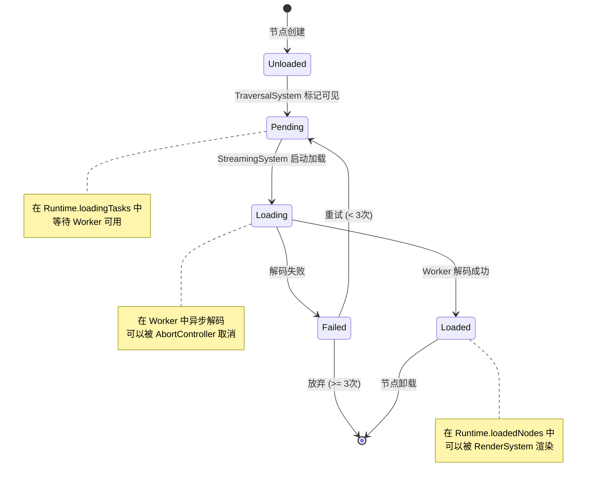
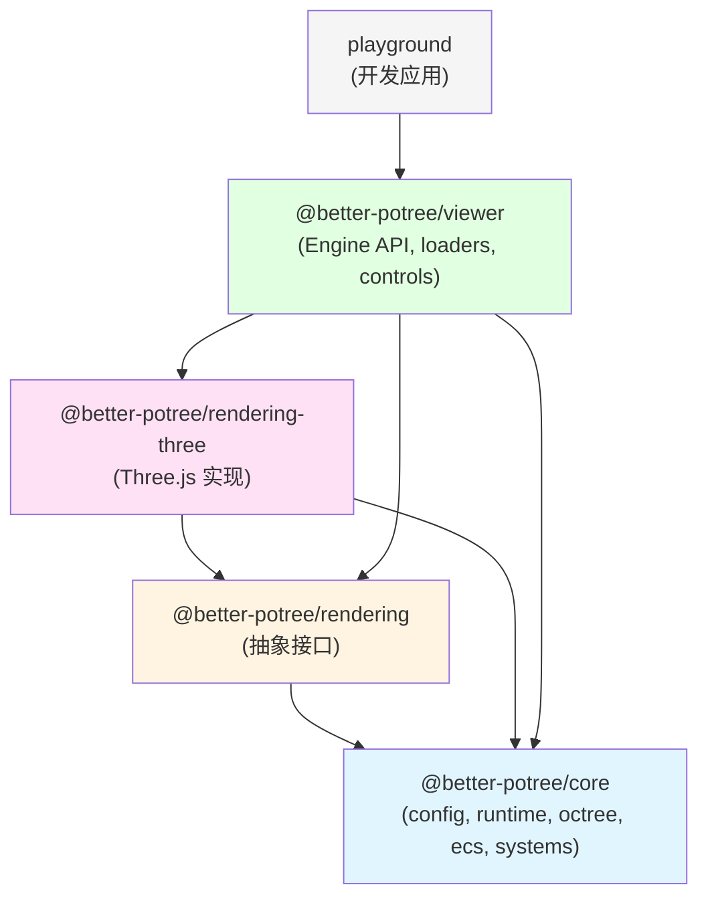

# **`better-potree` - 终极架构设计方案 (v8.0)**

**版本**: v8.0 - 最优实践版
**状态**: ✅ 已批准实施
**最后更新**: 2025-11-16
**评审评分**: 9.5/10

---

## 📋 **文档导航**

- [1. 执行摘要](#1-执行摘要)
- [2. 核心架构原则](#2-核心架构原则)
- [3. 整体架构设计](#3-整体架构设计)
- [4. 分层状态管理](#4-分层状态管理)
- [5. 空间分区系统（八叉树）](#5-空间分区系统八叉树)
- [6. 系统调度机制](#6-系统调度机制)
- [7. ECS 数据模型](#7-ecs-数据模型)
- [8. 核心系统详解](#8-核心系统详解)
- [9. 异步处理与资源管理](#9-异步处理与资源管理)
- [10. 性能优化基础设施](#10-性能优化基础设施)
- [11. 数据流与生命周期](#11-数据流与生命周期)
- [12. API 设计示例](#12-api-设计示例)
- [13. 模块划分](#13-模块划分)
- [14. 实施路线图](#14-实施路线图)
- [15. 测试策略](#15-测试策略)
- [16. 性能目标与验证](#16-性能目标与验证)
- [17. 风险评估与缓解](#17-风险评估与缓解)

---

## 1. 执行摘要

### 1.1 项目愿景

`better-potree` 致力于成为 Web 平台**专业级、大规模空间数据可视化的首选引擎**。它专为解决 GIS、数字孪生、BIM 和自动驾驶等领域的极限挑战而生，将亿级点云和前沿的 3D Gaussian Splatting 渲染提升至新的高度。

### 1.2 核心架构特性

本方案通过**八叉树驱动的分层状态管理**和**完整的性能基础设施**实现了最优架构：

```typescript
// 配置层 (Zustand) - 低频、声明式
const config = {
  sources: {
    pc1: { id: 'pc1', type: 'potree', url: '/meta.json', visible: true } // Potree 2.0 meta.json
  },
  rendering: { pointBudget: 2_000_000, minNodeSize: 100 }
};

// 运行时层 (可变) - 高频、命令式
class Runtime {
  visibleNodes = new Set<string>();      // 每帧更新，零 GC
  loadedNodes = new Map<string, Data>(); // 可变集合
}

// 八叉树层 - 空间分区核心
class OctreeManager {
  private octrees = new Map<string, OctreeNode>();
  private nodeIndex = new Map<string, OctreeNode>();
}
```

**关键优势**:
- ✅ **性能**: 高频路径零 GC 压力
- ✅ **易用性**: 声明式 API 对用户友好
- ✅ **可维护性**: 职责清晰，易于测试
- ✅ **可扩展性**: 插件系统简单明了
- ✅ **空间效率**: 八叉树驱动的智能加载

---

## 2. 核心架构原则

### 2.1 分层状态管理 (Tiered State Management) ⭐

这是整个架构的基石。

#### 配置状态 (Config State)

**管理方式**: Zustand Store
**更新频率**: 低频 (用户操作、配置变更)
**数据特征**: 不可变、可序列化、可持久化
**职责**: 描述"用户想要什么"

```typescript
// packages/core/src/config/types.ts
export type EngineConfig = Partial<ConfigState>; // Engine 接收 Partial，createConfigStore 会填充默认值

export interface SourceConfig {
  id: string;
  type: 'potree' | '3dgs' | string;
  /** Potree 2.0 meta.json 或 3DGS 元数据入口 */
  url: string;
  visible: boolean;
  transform?: Matrix4;
  materialId?: string;
}
```

#### 运行时状态 (Runtime State)

**管理方式**: 自定义可变类
**更新频率**: 高频 (每帧、每次加载)
**数据特征**: 可变、高性能、不可序列化
**职责**: 描述"引擎当前在做什么"

```typescript
// packages/core/src/runtime/Runtime.ts
export class Runtime {
  // 相机状态 (每帧更新)
  camera: Camera;

  // 渲染配置（从 Config 同步而来）
  rendering = {
    pointBudget: 2_000_000,
    minNodeSize: 100
  };

  // 可见性管理 (每帧更新)
  visibleNodes = new Set<string>();
  visibleNodesList: string[] = []; // 用于稳定迭代

  // 加载管理 (异步更新)
  loadingTasks = new Map<string, LoadTask>();
  loadedNodes = new Map<string, NodeData>();

  // 资源管理
  gpuResources = new Map<string, GPUResource>();

  // 性能统计
  stats = {
    frameTime: 0,
    drawCalls: 0,
    pointsRendered: 0,
    memoryUsed: { gpu: 0, cpu: 0 }
  };

  // 性能预算
  readonly budgets = {
    gpuMemory: 2 * 1024 * 1024 * 1024, // 2GB
    cpuMemory: 1 * 1024 * 1024 * 1024  // 1GB
  };
}
```

### 2.2 空间分区优先 (Spatial Partitioning First) ⭐

**八叉树是核心基础设施**，不是可选优化：

- ✅ **必须**: 所有点云数据通过八叉树组织
- ✅ **必须**: 支持视锥剔除和 LOD 选择
- ✅ **必须**: 支持流式加载（按需加载节点）
- ✅ **必须**: 支持多个点云数据源

### 2.3 单向数据流 (Unidirectional Data Flow)



**关键规则**:
1. ✅ **Config → Runtime**: 单向同步，由 `StateCoordinator` 负责
2. ✅ **Systems → Runtime**: 系统只读写 Runtime，不访问 Config
3. ✅ **Systems → Octree**: 系统查询八叉树获取空间信息
4. ✅ **Runtime ↛ Config**: Runtime 永远不反向修改 Config
5. ✅ **用户修改**: 必须通过 Engine API → Config → Coordinator → Runtime

### 2.4 简化的系统调度

放弃复杂的拓扑排序，采用**阶段 (Stage) + 优先级 (Priority)** 的固定顺序。

```typescript
// packages/core/src/types/system.ts
export enum SystemStage {
  INPUT = 0,      // 输入处理
  UPDATE = 100,   // 核心逻辑
  RENDER = 200,   // 渲染
  CLEANUP = 300   // 清理
}

export interface ISystem {
  readonly name: string;
  readonly stage: SystemStage;
  readonly priority?: number; // 同阶段内的相对顺序，默认 0

  update(deltaTime: number): void;
  dispose?(): void;
}
```

**优势**:
- ✅ 零运行时开销
- ✅ 执行顺序一目了然
- ✅ 易于调试和理解
- ✅ 无循环依赖风险

### 2.5 务实的 ECS 策略

#### Phase 1: 自定义轻量级实现

```typescript
// packages/core/src/ecs/SimpleECS.ts
type Entity = number;

export class SimpleECS {
  private nextEntityId = 0;
  private components = new Map<Function, Map<Entity, any>>();

  createEntity(): Entity {
    return this.nextEntityId++;
  }

  addComponent<T>(entity: Entity, component: T): void {
    const ctor = component.constructor;
    if (!this.components.has(ctor)) {
      this.components.set(ctor, new Map());
    }
    this.components.get(ctor)!.set(entity, component);
  }

  getComponent<T>(entity: Entity, ctor: new (...args: any[]) => T): T | undefined {
    return this.components.get(ctor)?.get(entity);
  }

  query<T>(...ctors: Array<new (...args: any[]) => any>): Entity[] {
    // 基于最小组件集的高效查询
    const smallestSet = this.findSmallestComponentSet(ctors);
    return Array.from(smallestSet.keys()).filter(entity =>
      ctors.every(ctor => this.components.get(ctor)?.has(entity))
    );
  }
}
```

#### Phase 3: 性能评估后考虑迁移

```typescript
// 如果性能测试显示瓶颈，迁移到 bitecs
// @todo: Phase 3 - Benchmark and consider migrating to bitecs
```

### 2.6 性能与资源管理优先

性能优化不是"锦上添花"，而是架构的**一级公民**。

```typescript
// packages/core/src/resources/
export class ResourceManager { constructor(public memoryLimit: number) {} /* GPU 资源管理 + LRU */ }
export class ObjectPools { /* 对象池 */ }
export class WorkerPool { /* Web Worker 池 */ }
export class MessageQueue { /* 异步消息队列 */ }
```

---

## 3. 整体架构设计

### 3.1 架构分层图



---

## 4. 分层状态管理

### 4.1 Config Store 实现

```typescript
// file: packages/core/src/config/store.ts
import { createStore } from 'zustand/vanilla';

export interface SourceConfig {
  id: string;
  type: 'potree' | '3dgs' | string;
  url: string;
  visible?: boolean;
  transform?: number[]; // 4x4 Matrix
  materialId?: string;
}

export interface MaterialConfig {
  id: string;
  type: 'point' | 'gaussian' | string;
  size?: number;
  colorEncoding?: 'RGB' | 'INTENSITY' | 'CLASSIFICATION';
}

export interface RenderingConfig {
  pointBudget: number;
  fov: number;
  minNodeSize: number;
}

export interface ConfigState {
  sources: Record<string, SourceConfig>;
  materials: Record<string, MaterialConfig>;
  rendering: RenderingConfig;
  camera: {
    position: [number, number, number];
    target: [number, number, number];
  };
}

export interface ConfigStore extends ConfigState {
  // Actions
  addSource: (config: SourceConfig) => void;
  removeSource: (id: string) => void;
  updateSource: (id: string, partial: Partial<SourceConfig>) => void;
  setRenderingConfig: (config: Partial<RenderingConfig>) => void;
}

export const createConfigStore = (initial?: Partial<ConfigState>) => {
  return createStore<ConfigStore>()((set) => ({
    // Initial state
    sources: {},
    materials: {},
    rendering: {
      pointBudget: 2_000_000,
      fov: 60,
      minNodeSize: 100,
    },
    camera: {
      position: [0, 0, 10],
      target: [0, 0, 0],
    },
    ...initial,

    // Actions
    addSource: (config) => set((state) => ({
      sources: { ...state.sources, [config.id]: config }
    })),

    removeSource: (id) => set((state) => {
      const { [id]: _, ...rest } = state.sources;
      return { sources: rest };
    }),

    updateSource: (id, partial) => set((state) => ({
      sources: {
        ...state.sources,
        [id]: { ...state.sources[id], ...partial }
      }
    })),

    setRenderingConfig: (config) => set((state) => ({
      rendering: { ...state.rendering, ...config }
    })),
  }));
};

// Engine API 侧保持一致：透传 Record 形式的 sources（Potree 2.0 使用 meta.json）
const engine = new Engine({
  sources: {
    main: { id: 'main', type: 'potree', url: '/meta.json', visible: true }
  }
});
```

### 4.2 Runtime State 实现

```typescript
// file: packages/core/src/runtime/Runtime.ts
import type { Camera } from 'three';
import { PerspectiveCamera } from 'three';
import type { OctreeManager } from '../octree/OctreeManager';
import type { ECSWorld } from '../ecs/ECSWorld';
import type { ResourceManager } from '../resources/ResourceManager';

/** 节点加载任务 */
export interface LoadTask {
  nodeId: string;
  sourceId: string;
  url: string;
  priority: number;
  status: 'pending' | 'loading' | 'loaded' | 'failed';
  abortController?: AbortController;
  data?: NodeData;
  error?: string;
  retryCount: number;
  startTime?: number;
}

/** 运行时状态（完全可变） */
export class Runtime {
  // 相机状态（每帧可能更新）
  public camera: Camera;

  // 渲染配置（从 Config 同步而来）
  public rendering = {
    pointBudget: 2_000_000,
    minNodeSize: 100
  };

  // 可见性管理（每帧更新）
  public visibleNodes = new Set<string>();
  public visibleNodesList: string[] = []; // 用于稳定迭代

  // 加载管理
  public loadingTasks = new Map<string, LoadTask>();
  public loadedNodes = new Map<string, NodeData>();

  // 数据源状态
  public sources = new Map<string, SourceRuntimeState>();

  // GPU 资源管理
  public gpuResources = new Map<string, GPUResource>();

  // 性能统计
  public stats = {
    frameTime: 0,
    systemTimes: new Map<string, number>(),
    drawCalls: 0,
    pointsRendered: 0,
    nodesLoaded: 0,
    memoryUsed: { gpu: 0, cpu: 0 }
  };

  // 内存预算
  public readonly budgets = {
    gpuMemory: 2 * 1024 * 1024 * 1024, // 2GB
    cpuMemory: 1 * 1024 * 1024 * 1024  // 1GB
  };
  // ResourceManager 建议使用 runtime.budgets.gpuMemory 作为 memoryLimit

  constructor(camera: Camera = new PerspectiveCamera()) {
    this.camera = camera;
  }

  /** 检查 GPU 内存预算 */
  checkGPUMemoryBudget(requiredBytes: number): boolean {
    return this.stats.memoryUsed.gpu + requiredBytes < this.budgets.gpuMemory;
  }

  /** 清理不再可见的节点 */
  cleanupInvisibleNodes(): void {
    for (const [nodeId, task] of this.loadingTasks) {
      if (!this.visibleNodes.has(nodeId) && task.status === 'loading') {
        task.abortController?.abort();
        this.loadingTasks.delete(nodeId);
      }
    }
  }

  /** 驱逐不可见且已加载的节点，防止 GPU/CPU 内存累积 */
  evictInvisibleLoadedNodes(resourceManager: ResourceManager): void {
    for (const [nodeId, data] of this.loadedNodes) {
      if (!this.visibleNodes.has(nodeId)) {
        if (data.gpuResourceId) {
          resourceManager.releaseById(data.gpuResourceId);
        }
        this.loadedNodes.delete(nodeId);
      }
    }
  }
}

/** 数据源运行时状态 */
interface SourceRuntimeState {
  config: SourceConfig;
  loadedNodes: Map<string, NodeData>;
  visibleNodes: Set<string>;
  loadState: 'loading' | 'loaded' | 'failed';
}
```

### 4.3 StateCoordinator 完整实现

```typescript
// file: packages/core/src/coordinator/StateCoordinator.ts
import type { ConfigStore, SourceConfig, RenderingConfig } from '../config/store';
import type { Runtime } from '../runtime/Runtime';
import type { OctreeManager } from '../octree/OctreeManager';
import type { ResourceManager } from '../resources/ResourceManager';
import type { ECSWorld } from '../ecs/ECSWorld';
import { SourceComponent } from '../ecs/components';

export class StateCoordinator {
  private unsubscribers: Array<() => void> = [];

  constructor(
    private configStore: ConfigStore,
    private runtime: Runtime,
    private octreeManager: OctreeManager,
    private resourceManager: ResourceManager,
    private ecs: ECSWorld
  ) {
    this.setupSubscriptions();
  }

  /** 初始同步：将配置同步到运行时 */
  public initialSync(): void {
    const state = this.configStore.getState();
    this.syncSources(state.sources);
    this.syncRenderingConfig(state.rendering);
    this.syncCamera(state.camera);
  }

  /** 设置配置变更订阅 */
  private setupSubscriptions(): void {
    // 订阅 sources 变化
    this.unsubscribers.push(
      this.configStore.subscribe(
        (state) => state.sources,
        (sources) => this.syncSources(sources)
      )
    );

    // 订阅渲染配置变化
    this.unsubscribers.push(
      this.configStore.subscribe(
        (state) => state.rendering,
        (config) => this.syncRenderingConfig(config)
      )
    );
  }

  /** 同步数据源配置 */
  private syncSources(sources: Record<string, SourceConfig>): void {
    const oldIds = new Set(this.runtime.sources.keys());
    const newIds = new Set(Object.keys(sources));

    // 处理新增的 source
    for (const id of newIds) {
      if (!oldIds.has(id)) {
        this.addSource(sources[id]);
      } else {
        this.updateSource(sources[id]);
      }
    }

    // 处理删除的 source
    for (const id of oldIds) {
      if (!newIds.has(id)) {
        this.removeSource(id);
      }
    }
  }

  /** 添加新的 source */
  private addSource(config: SourceConfig): void {
    // 1. 在 Runtime 中初始化状态 (存储配置副本,避免直接引用)
    this.runtime.sources.set(config.id, {
      config: { ...config },
      loadedNodes: new Map(),
      visibleNodes: new Set(),
      loadState: 'loading'
    });

    // 2. 在 ECS 中创建实体
    const entity = this.ecs.createEntity();
    this.ecs.addComponent(entity, SourceComponent, new SourceComponent(config));

    // 3. 异步加载八叉树元数据
    this.octreeManager.loadOctree(config.id, config.url, config.type)
      .then(() => {
        const sourceState = this.runtime.sources.get(config.id);
        if (sourceState) {
          sourceState.loadState = 'loaded';
        }
        console.log(`[Coordinator] Octree loaded for source: ${config.id}`);
      })
      .catch((error) => {
        console.error(`[Coordinator] Failed to load octree for ${config.id}:`, error);
        const sourceState = this.runtime.sources.get(config.id);
        if (sourceState) {
          sourceState.loadState = 'failed';
        }
        // 可选: 自动移除加载失败的 source
        // this.removeSource(config.id);
      });
  }

  /** 删除 source 并清理资源 */
  private removeSource(sourceId: string): void {
    const sourceState = this.runtime.sources.get(sourceId);
    if (!sourceState) return;

    // 1. 取消所有进行中的加载任务
    for (const [nodeId, task] of this.runtime.loadingTasks) {
      if (task.sourceId === sourceId) {
        task.abortController?.abort();
        this.runtime.loadingTasks.delete(nodeId);
      }
    }

    // 2. 释放 GPU 资源
    for (const [nodeId, resource] of this.runtime.gpuResources) {
      if (nodeId.startsWith(sourceId)) {
        this.resourceManager.release(resource);
        this.runtime.gpuResources.delete(nodeId);
      }
    }

    // 3. 从 ECS 中删除相关实体
    const entities = this.ecs.query(SourceComponent);
    for (const entity of entities) {
      const comp = this.ecs.getComponent(entity, SourceComponent);
      if (comp?.id === sourceId) {
        this.ecs.removeEntity(entity);
      }
    }

    // 4. 从八叉树管理器中移除
    this.octreeManager.removeOctree(sourceId);

    // 5. 从 Runtime 中删除
    this.runtime.sources.delete(sourceId);

    // 6. 清理运行时状态
    this.cleanupRuntimeState(sourceId);
  }

  /** 更新 source 配置 */
  private updateSource(config: SourceConfig): void {
    const sourceState = this.runtime.sources.get(config.id);
    if (!sourceState) return;

    // 检查哪些属性发生了变化
    const oldConfig = sourceState.config;

    if (oldConfig.visible !== config.visible) {
      // 可见性变化，清空可见节点集合
      sourceState.visibleNodes.clear();
    }

    if (oldConfig.transform !== config.transform) {
      // 变换矩阵变化，需要重新计算可见性
      // (由 TraversalSystem 在下一帧处理)
    }

    // 更新配置
    sourceState.config = config;
  }

  /** 同步渲染配置 */
  private syncRenderingConfig(config: RenderingConfig): void {
    this.runtime.rendering.pointBudget = config.pointBudget;
    this.runtime.rendering.minNodeSize = config.minNodeSize;
  }

  /** 同步相机配置 */
  private syncCamera(camera: { position: [number, number, number]; target: [number, number, number] }): void {
    this.runtime.camera.position.fromArray(camera.position);
    // ... 更新 lookAt
  }

  /** 清理运行时状态 */
  private cleanupRuntimeState(sourceId: string): void {
    // 从可见节点集合中移除
    for (const nodeId of this.runtime.visibleNodes) {
      if (nodeId.startsWith(sourceId)) {
        this.runtime.visibleNodes.delete(nodeId);
      }
    }
    // 清理已加载节点
    for (const nodeId of this.runtime.loadedNodes.keys()) {
      if (nodeId.startsWith(sourceId)) {
        this.runtime.loadedNodes.delete(nodeId);
      }
    }
  }

  /** 销毁 */
  public dispose(): void {
    this.unsubscribers.forEach(unsub => unsub());
    this.unsubscribers = [];
  }
}

/** 工具函数: 集合差集 */
function setDifference<T>(a: Set<T>, b: Set<T>): Set<T> {
  return new Set([...a].filter(x => !b.has(x)));
}
```

**状态转换表**:

| 配置变更 | Runtime 操作 | ECS 操作 | Octree 操作 | 资源操作 | loadState |
|---------|-------------|---------|------------|---------|-----------|
| 添加 source | 初始化状态(副本) | 创建实体 | 异步加载元数据 | - | loading → loaded/failed |
| 删除 source | 清理状态 | 删除实体 | 移除八叉树 | 释放 GPU 资源 | - |
| 修改 visible | 清空可见集合 | - | - | - | 保持不变 |
| 修改 transform | 标记需重算 | 更新组件 | - | - | 保持不变 |
| 修改 pointBudget | 更新渲染配置 | - | - | - | - |

---

## 5. 空间分区系统（八叉树）

### 5.1 核心地位

**八叉树是点云渲染引擎的基础设施**，不是可选优化：

- ✅ **必须**: 所有点云数据通过八叉树组织
- ✅ **必须**: 支持视锥剔除和 LOD 选择
- ✅ **必须**: 支持流式加载（按需加载节点）
- ✅ **必须**: 支持多个点云数据源

### 5.2 八叉树节点定义

```typescript
// file: packages/core/src/octree/OctreeNode.ts
import { Box3, Vector3 } from 'three';

export interface OctreeNodeMetadata {
  /** 节点唯一标识 */
  id: string;

  /** 所属数据源 */
  sourceId: string;

  /** 节点名称（如 "r0123"） */
  name: string;

  /** 节点层级（0 = 根节点） */
  level: number;

  /** 空间包围盒 */
  boundingBox: Box3;

  /** 节点中心点 */
  center: Vector3;

  /** 节点包含的点数 */
  numPoints: number;

  /** 节点数据 URL */
  url: string;

  /** 子节点索引（0-7，-1 表示无子节点） */
  children: number[];

  /** 节点间距（spacing） */
  spacing: number;
}

export class OctreeNode {
  public metadata: OctreeNodeMetadata;

  /** 子节点引用 */
  public childNodes: (OctreeNode | null)[] = new Array(8).fill(null);

  /** 父节点引用 */
  public parent: OctreeNode | null = null;

  /** 加载状态 */
  public loadState: 'unloaded' | 'loading' | 'loaded' | 'failed' = 'unloaded';

  /** GPU 资源句柄 */
  public gpuResourceId?: string;

  constructor(metadata: OctreeNodeMetadata) {
    this.metadata = metadata;
  }

  /** 是否是叶子节点 */
  get isLeaf(): boolean {
    return this.metadata.children.every(c => c === -1);
  }

  /** 获取所有已加载的子节点 */
  getLoadedChildren(): OctreeNode[] {
    return this.childNodes.filter(
      (node): node is OctreeNode => node !== null && node.loadState === 'loaded'
    );
  }
}
```

### 5.3 八叉树管理器完整实现

```typescript
// file: packages/core/src/octree/OctreeManager.ts
import type { OctreeNode, OctreeNodeMetadata } from './OctreeNode';
import { Box3, Vector3 } from 'three';

export interface OctreeMetadata {
  sourceId: string;
  version: string;
  boundingBox: Box3;
  spacing: number;
  scale: number;
  hierarchyStepSize: number;
  pointAttributes: string[];
}

export class OctreeManager {
  /** 所有八叉树的根节点 */
  private octrees = new Map<string, OctreeNode>();

  /** 所有节点的扁平索引（用于快速查找） */
  private nodeIndex = new Map<string, OctreeNode>();

  /** 八叉树元数据 */
  private metadata = new Map<string, OctreeMetadata>();

  /** 加载八叉树元数据 */
  async loadOctree(sourceId: string, url: string, type: string): Promise<void> {
    // 1. 加载 meta.json（Potree 2.0）或其他元数据文件
    const metadata = await this.fetchMetadata(url, type);
    this.metadata.set(sourceId, metadata);

    // 2. 创建根节点
    const rootNode = this.createRootNode(sourceId, metadata);
    this.octrees.set(sourceId, rootNode);
    this.nodeIndex.set(rootNode.metadata.id, rootNode);

    // 3. 构建第一层子节点（不加载数据，只构建结构）
    await this.buildInitialHierarchy(rootNode, url);
  }

  /** 获取节点 */
  getNode(nodeId: string): OctreeNode | undefined {
    return this.nodeIndex.get(nodeId);
  }

  /** 获取所有数据源 ID */
  getAllSourceIds(): string[] {
    return Array.from(this.octrees.keys());
  }

  /** 获取所有根节点 */
  getRootNodes(): OctreeNode[] {
    return Array.from(this.octrees.values());
  }

  /** 移除八叉树 */
  removeOctree(sourceId: string): void {
    const root = this.octrees.get(sourceId);
    if (!root) return;

    // 递归移除所有节点
    this.removeNodeRecursive(root);
    this.octrees.delete(sourceId);
    this.metadata.delete(sourceId);
  }

  /** 递归移除节点 */
  private removeNodeRecursive(node: OctreeNode): void {
    for (const child of node.childNodes) {
      if (child) this.removeNodeRecursive(child);
    }
    this.nodeIndex.delete(node.metadata.id);
  }

  /** 根据包围盒查询节点 */
  queryNodesByBounds(bounds: Box3): OctreeNode[] {
    const result: OctreeNode[] = [];
    for (const root of this.octrees.values()) {
      this.queryNodesByBoundsRecursive(root, bounds, result);
    }
    return result;
  }

  private queryNodesByBoundsRecursive(
    node: OctreeNode,
    bounds: Box3,
    result: OctreeNode[]
  ): void {
    if (!node.metadata.boundingBox.intersectsBox(bounds)) return;

    result.push(node);

    for (const child of node.childNodes) {
      if (child) this.queryNodesByBoundsRecursive(child, bounds, result);
    }
  }

  /** 获取元数据 */
  private async fetchMetadata(url: string, type: string): Promise<OctreeMetadata> {
    // 实现根据类型加载不同格式的元数据
    if (type === 'potree') {
      return this.fetchPotree2Metadata(url); // Potree 2.0 meta.json
    }
    if (type === '3dgs') {
      return this.fetch3dgsMetadata(url);
    }
    throw new Error(`Unsupported octree type: ${type}`);
  }

  /** Potree 2.0 - meta.json */
  private async fetchPotree2Metadata(url: string): Promise<OctreeMetadata> {
    const response = await fetch(url);
    const data = await response.json();

    // meta.json 结构示例:
    // {
    //   "version": "2.0",
    //   "octreeDir": "data",
    //   "bounds": { "min": [x,y,z], "max": [x,y,z] },
    //   "spacing": 1.0,
    //   "scale": 0.01,
    //   "hierarchyStepSize": 5,
    //   "pointAttributes": ["POSITION_CARTESIAN", "COLOR_PACKED"]
    // }
    return {
      sourceId: '',
      version: data.version ?? '2.0',
      boundingBox: new Box3(
        new Vector3().fromArray(data.bounds.min),
        new Vector3().fromArray(data.bounds.max)
      ),
      spacing: data.spacing ?? 1,
      scale: data.scale ?? 0.01,
      hierarchyStepSize: data.hierarchyStepSize ?? 5,
      pointAttributes: data.pointAttributes ?? ['POSITION_CARTESIAN', 'COLOR_PACKED']
    };
  }

  /** 3D Gaussian Splatting 使用 BVH/球树结构，这里只加载包围盒和 spacing 供遍历 */
  private async fetch3dgsMetadata(url: string): Promise<OctreeMetadata> {
    const response = await fetch(url);
    const data = await response.json();

    return {
      sourceId: '',
      version: data.version ?? '1.0',
      boundingBox: new Box3(
        new Vector3().fromArray(data.bounds.min),
        new Vector3().fromArray(data.bounds.max)
      ),
      spacing: data.spacing ?? 1,
      scale: data.scale ?? 0.01,
      hierarchyStepSize: data.hierarchyStepSize ?? 4,
      pointAttributes: data.pointAttributes ?? ['POSITION_CARTESIAN', 'COLOR_PACKED']
    };
  }

  private createRootNode(sourceId: string, metadata: OctreeMetadata): OctreeNode {
    const nodeMetadata: OctreeNodeMetadata = {
      id: `${sourceId}/r`,
      sourceId,
      name: 'r',
      level: 0,
      boundingBox: metadata.boundingBox.clone(),
      center: metadata.boundingBox.getCenter(new Vector3()),
      numPoints: 0, // 从 hierarchy 文件中获取
      url: '', // 从 hierarchy 文件中获取
      children: new Array(8).fill(-1),
      spacing: metadata.spacing
    };

    return new OctreeNode(nodeMetadata);
  }

  private async buildInitialHierarchy(root: OctreeNode, baseUrl: string): Promise<void> {
    // 加载层级结构文件
    // 这里简化处理，实际需要解析 .hrc 文件
    // TODO: 实现完整的层级结构加载
  }
}
```

---

## 6. 系统调度机制

### 6.1 SystemScheduler 实现

```typescript
// packages/core/src/scheduler/SystemScheduler.ts
import type { ISystem, SystemStage } from '../types/system';
import type { Runtime } from '../runtime/Runtime';

export class SystemScheduler {
  private systems = new Map<SystemStage, ISystem[]>();
  private isRunning = false;

  constructor(private runtime: Runtime) {
    // 初始化所有阶段
    for (const stage of Object.values(SystemStage)) {
      if (typeof stage === 'number') {
        this.systems.set(stage, []);
      }
    }
  }

  /** 注册系统 */
  register(system: ISystem): void {
    const stageSystems = this.systems.get(system.stage);
    if (!stageSystems) {
      throw new Error(`Invalid system stage: ${system.stage}`);
    }

    stageSystems.push(system);

    // 按优先级排序（只在注册时计算一次）
    stageSystems.sort((a, b) => (a.priority ?? 0) - (b.priority ?? 0));

    console.log(`[Scheduler] Registered system: ${system.name} (stage=${system.stage}, priority=${system.priority ?? 0})`);
  }

  /** 执行一帧 */
  run(deltaTime: number): void {
    if (!this.isRunning) return;

    const frameStartTime = performance.now();

    // 严格按照阶段顺序执行
    this.runStage(SystemStage.INPUT, deltaTime);
    this.runStage(SystemStage.UPDATE, deltaTime);
    this.runStage(SystemStage.RENDER, deltaTime);
    this.runStage(SystemStage.CLEANUP, deltaTime);

    // 记录总帧时间
    this.runtime.stats.frameTime = performance.now() - frameStartTime;
  }

  private runStage(stage: SystemStage, deltaTime: number): void {
    const systems = this.systems.get(stage);
    if (!systems) return;

    for (const system of systems) {
      const startTime = performance.now();

      try {
        system.update(deltaTime);
      } catch (error) {
        console.error(`[Scheduler] Error in system ${system.name}:`, error);
      }

      // 记录系统耗时
      const duration = performance.now() - startTime;
      this.runtime.stats.systemTimes.set(system.name, duration);
    }
  }

  /** 启动调度器 */
  start(): void {
    this.isRunning = true;
  }

  /** 停止调度器 */
  stop(): void {
    this.isRunning = false;
  }

  /** 销毁所有系统 */
  dispose(): void {
    for (const systems of this.systems.values()) {
      for (const system of systems) {
        system.dispose?.();
      }
    }
    this.systems.clear();
  }
}
```

---

## 7. ECS 数据模型

### 7.1 ECS World 实现

```typescript
// file: packages/core/src/ecs/ECSWorld.ts

export type Entity = number;

/** 组件基类 */
export interface Component {
  __componentType?: string;
}

/** ECS 世界 */
export class ECSWorld {
  private nextEntityId = 0;
  private entities = new Set<Entity>();

  // 组件存储: Map<ComponentClass, Map<Entity, ComponentInstance>>
  private components = new Map<any, Map<Entity, any>>();

  /** 创建实体 */
  createEntity(): Entity {
    const entity = this.nextEntityId++;
    this.entities.add(entity);
    return entity;
  }

  /** 删除实体 */
  removeEntity(entity: Entity): void {
    this.entities.delete(entity);

    // 删除所有组件
    for (const componentMap of this.components.values()) {
      componentMap.delete(entity);
    }
  }

  /** 添加组件 */
  addComponent<T extends Component>(
    entity: Entity,
    componentClass: new (...args: any[]) => T,
    component: T
  ): void {
    let componentMap = this.components.get(componentClass);
    if (!componentMap) {
      componentMap = new Map();
      this.components.set(componentClass, componentMap);
    }
    componentMap.set(entity, component);
  }

  /** 获取组件 */
  getComponent<T extends Component>(
    entity: Entity,
    componentClass: new (...args: any[]) => T
  ): T | undefined {
    return this.components.get(componentClass)?.get(entity);
  }

  /** 移除组件 */
  removeComponent<T extends Component>(
    entity: Entity,
    componentClass: new (...args: any[]) => T
  ): void {
    this.components.get(componentClass)?.delete(entity);
  }

  /** 检查是否有组件 */
  hasComponent<T extends Component>(
    entity: Entity,
    componentClass: new (...args: any[]) => T
  ): boolean {
    return this.components.get(componentClass)?.has(entity) ?? false;
  }

  /** 查询拥有指定组件的实体 */
  query<T extends Component>(...componentClasses: Array<new (...args: any[]) => T>): Entity[] {
    if (componentClasses.length === 0) return Array.from(this.entities);

    // 找到拥有最少实体的组件（优化查询性能）
    let smallestSet: Set<Entity> | undefined;
    let smallestSize = Infinity;

    for (const componentClass of componentClasses) {
      const componentMap = this.components.get(componentClass);
      if (!componentMap) return []; // 如果某个组件没有任何实体，直接返回空

      const size = componentMap.size;
      if (size < smallestSize) {
        smallestSize = size;
        smallestSet = new Set(componentMap.keys());
      }
    }

    if (!smallestSet) return [];

    // 过滤出同时拥有所有组件的实体
    const result: Entity[] = [];
    for (const entity of smallestSet) {
      if (componentClasses.every(cls => this.hasComponent(entity, cls))) {
        result.push(entity);
      }
    }

    return result;
  }

  /** 清空所有实体 */
  clear(): void {
    this.entities.clear();
    this.components.clear();
    this.nextEntityId = 0;
  }

  /** 获取统计信息 */
  getStats() {
    return {
      entityCount: this.entities.size,
      componentTypeCount: this.components.size,
      componentCount: Array.from(this.components.values())
        .reduce((sum, map) => sum + map.size, 0)
    };
  }
}
```

### 7.2 组件定义

```typescript
// file: packages/core/src/ecs/components.ts
import type { Vector3, Matrix4 } from 'three';
import type { Component } from './ECSWorld';
import type { SourceConfig } from '../config/types';

/** 数据源组件 */
export class SourceComponent implements Component {
  public id: string;
  public type: string;
  public url: string;
  public visible: boolean;

  constructor(config: SourceConfig) {
    this.id = config.id;
    this.type = config.type;
    this.url = config.url;
    this.visible = config.visible ?? true;
  }

  static fromConfig(config: SourceConfig): SourceComponent {
    return new SourceComponent(config);
  }
}

/** 变换组件 */
export class Transform implements Component {
  constructor(
    public position: Vector3,
    public rotation: Vector3,
    public scale: Vector3,
    public matrix: Matrix4
  ) {}
}

/** 可见性组件 */
export class Visibility implements Component {
  constructor(public visible: boolean = true) {}
}

/** 点云节点数据组件 */
export class PotreeNodeData implements Component {
  constructor(
    public nodeId: string,
    public sourceId: string,
    public numPoints: number,
    public gpuBufferId?: string
  ) {}
}

/** 高斯球数据组件 */
export class GaussianSplatData implements Component {
  constructor(
    public splatId: string,
    public numSplats: number,
    public gpuBufferId?: string
  ) {}
}

/** 包围盒组件 */
export class BoundingBox implements Component {
  constructor(
    public min: Vector3,
    public max: Vector3
  ) {}
}
```
---

## 8. 核心系统详解

### 8.1 TraversalSystem (遍历系统)

**职责**: 视锥剔除 + LOD 选择

```typescript
// packages/core/src/systems/TraversalSystem.ts
import type { ISystem, SystemStage } from '../types/system';
import type { Runtime } from '../runtime/Runtime';
import type { OctreeManager } from '../octree/OctreeManager';
import type { OctreeNode } from '../octree/OctreeNode';
import { Frustum, Matrix4, Vector3 } from 'three';

export class TraversalSystem implements ISystem {
  readonly name = 'bp:traversal';
  readonly stage = SystemStage.UPDATE;
  readonly priority = 0; // 最先执行

  private frustum = new Frustum();
  private projScreenMatrix = new Matrix4();

  constructor(
    private runtime: Runtime,
    private octreeManager: OctreeManager
  ) {}

  update(deltaTime: number): void {
    const startTime = performance.now();

    // 1. 更新视锥体
    this.updateFrustum();

    // 2. 清空上一帧的可见节点
    this.runtime.visibleNodes.clear();

    // 3. 遍历所有八叉树
    for (const rootNode of this.octreeManager.getRootNodes()) {
      this.traverseNode(rootNode);
    }

    // 4. 转换为数组（用于后续系统稳定迭代）
    this.runtime.visibleNodesList = Array.from(this.runtime.visibleNodes);

    // 5. 更新统计
    const duration = performance.now() - startTime;
    console.log(`[Traversal] Found ${this.runtime.visibleNodes.size} visible nodes in ${duration.toFixed(2)}ms`);
  }

  private updateFrustum(): void {
    this.projScreenMatrix.multiplyMatrices(
      this.runtime.camera.projectionMatrix,
      this.runtime.camera.matrixWorldInverse
    );
    this.frustum.setFromProjectionMatrix(this.projScreenMatrix);
  }

  private traverseNode(node: OctreeNode): void {
    // 1. 视锥剔除
    if (!this.frustum.intersectsBox(node.metadata.boundingBox)) {
      return;
    }

    // 2. LOD 选择
    const screenSize = this.calculateScreenSize(node);

    if (screenSize < this.runtime.rendering.minNodeSize || node.isLeaf) {
      // 节点足够小或是叶子节点，加入可见集合
      this.runtime.visibleNodes.add(node.metadata.id);
      return;
    }

    // 3. 尝试使用子节点
    let hasLoadedChildren = false;
    for (const child of node.childNodes) {
      if (child && child.loadState === 'loaded') {
        hasLoadedChildren = true;
        this.traverseNode(child);
      }
    }

    // 4. 如果没有已加载的子节点，使用当前节点
    if (!hasLoadedChildren && node.loadState === 'loaded') {
      this.runtime.visibleNodes.add(node.metadata.id);
    }
  }

  private calculateScreenSize(node: OctreeNode): number {
    const distance = node.metadata.center.distanceTo(this.runtime.camera.position);
    const radius = node.metadata.boundingBox.getSize(new Vector3()).length() / 2;
    const fov = (this.runtime.camera as any).fov * Math.PI / 180;
    const height = window.innerHeight;

    return (radius / distance) * height / Math.tan(fov / 2);
  }

  dispose(): void {
    // 清理资源
  }
}
```

### 8.2 StreamingSystem (流式加载系统)

详细实现见第9节异步处理。

### 8.3 RenderSystem (渲染系统)

详细实现见第9节资源管理。

---

## 9. 异步处理与资源管理

### 9.1 MessageQueue (优先级消息队列)

```typescript
// file: packages/core/src/MessageQueue.ts

export enum MessagePriority {
  CRITICAL = 0,  // 必须立即处理
  HIGH = 1,      // 高优先级
  NORMAL = 2,    // 正常优先级
  LOW = 3        // 低优先级
}

export type SystemMessage =
  | { type: 'NODE_LOADED'; nodeId: string; data: ArrayBuffer; priority: MessagePriority }
  | { type: 'NODE_FAILED'; nodeId: string; error: string; priority: MessagePriority };

export class MessageQueue {
  private queues = new Map<MessagePriority, SystemMessage[]>();
  private readonly MAX_QUEUE_SIZE = 1000;

  constructor() {
    for (const priority of [0, 1, 2, 3]) {
      this.queues.set(priority, []);
    }
  }

  push(msg: SystemMessage): void {
    const queue = this.queues.get(msg.priority)!;
    if (queue.length >= this.MAX_QUEUE_SIZE && msg.priority >= MessagePriority.NORMAL) {
      console.warn(`[MessageQueue] Queue full, dropping message:`, msg);
      return;
    }
    queue.push(msg);
  }

  drain(budget: number = 100): SystemMessage[] {
    const result: SystemMessage[] = [];
    let remaining = budget;

    for (const priority of [0, 1, 2, 3]) {
      if (remaining <= 0) break;
      const queue = this.queues.get(priority)!;
      const batch = queue.splice(0, remaining);
      result.push(...batch);
      remaining -= batch.length;
    }

    return result;
  }
}
```

### 9.2 WorkerPool 实现

```typescript
// packages/core/src/resources/WorkerPool.ts
interface WorkerTask {
  url: string;
  signal: AbortSignal;
  resolve: (data: any) => void;
  reject: (error: Error) => void;
}

export class WorkerPool {
  private workers: Worker[] = [];
  private busyWorkers = new Set<Worker>();
  private taskQueue: WorkerTask[] = [];
  private readonly MAX_QUEUE_SIZE = 100;

  constructor(workerScript: string, workerCount: number = Math.max(1, navigator.hardwareConcurrency - 1)) {
    for (let i = 0; i < workerCount; i++) {
      this.workers.push(new Worker(workerScript));
    }
  }

  async decodeNode(url: string, signal: AbortSignal): Promise<NodeData> {
    if (this.taskQueue.length >= this.MAX_QUEUE_SIZE) {
      throw new Error('Worker queue full, please retry later');
    }

    return new Promise((resolve, reject) => {
      const task: WorkerTask = { url, signal, resolve, reject };

      // 监听取消
      signal.addEventListener('abort', () => {
        const idx = this.taskQueue.indexOf(task);
        if (idx !== -1) {
          this.taskQueue.splice(idx, 1);
          reject(new Error('Aborted'));
        }
      });

      this.taskQueue.push(task);
      this.scheduleNext();
    });
  }

  private scheduleNext(): void {
    const worker = this.getAvailableWorker();
    if (!worker || this.taskQueue.length === 0) return;

    const task = this.taskQueue.shift()!;
    if (task.signal.aborted) {
      task.reject(new Error('Aborted'));
      this.scheduleNext();
      return;
    }

    this.busyWorkers.add(worker);
    worker.postMessage({ type: 'DECODE_NODE', url: task.url });

    const onMessage = (e: MessageEvent) => {
      cleanup();
      task.resolve(e.data.result);
      this.scheduleNext();
    };
    const onError = (err: ErrorEvent) => {
      cleanup();
      task.reject(new Error(err.message));
      this.scheduleNext();
    };
    const cleanup = () => {
      worker.removeEventListener('message', onMessage);
      worker.removeEventListener('error', onError);
      this.busyWorkers.delete(worker);
    };

    worker.addEventListener('message', onMessage);
    worker.addEventListener('error', onError);
  }

  private getAvailableWorker(): Worker | undefined {
    return this.workers.find(w => !this.busyWorkers.has(w));
  }

  dispose(): void {
    for (const task of this.taskQueue) {
      task.reject(new Error('WorkerPool disposed'));
    }
    this.taskQueue.length = 0;

    for (const worker of this.workers) {
      worker.terminate();
    }
    this.workers.length = 0;
    this.busyWorkers.clear();
  }

  getStats() {
    return {
      totalWorkers: this.workers.length,
      busyWorkers: this.busyWorkers.size,
      availableWorkers: this.workers.length - this.busyWorkers.size,
      queuedTasks: this.taskQueue.length
    };
  }
}
```

---

## 10. 性能优化基础设施

### 10.1 ResourceManager (GPU 资源管理 + LRU)

```typescript
// packages/core/src/resources/ResourceManager.ts
export interface GPUResource {
  id: string;
  type: 'buffer' | 'texture';
  size: number;      // 字节数，用于预算判定
  handle: any;       // WebGL/WebGPU 句柄
  lastUsed: number;  // 更新时间戳，用于 LRU
}

export class ResourceManager {
  constructor(public memoryLimit: number) {}           // 推荐传入 runtime.budgets.gpuMemory
  allocate(id: string, type: GPUResource['type'], size: number, handle: any): GPUResource | null;
  release(resource: GPUResource): void;         // 释放并更新 memoryUsed
  releaseById(id: string): void;                // 便于 Runtime 通过 gpuResourceId 释放
  touch(id: string): void;                      // 渲染/使用后更新 LRU
  evictIfOverBudget(limitBytes?: number): void; // 预算检查 + LRU 驱逐，默认使用 memoryLimit
  getStats(): { resourceCount: number; memoryUsed: number; memoryLimit: number; memoryUsage: string };
}

// 关键逻辑（示例）
releaseById(id: string) {
  const res = this.resources.get(id);
  if (res) this.release(res);
}

evictIfOverBudget(limitBytes = this.memoryLimit) {
  if (this.memoryUsed <= limitBytes) return;
  const sorted = Array.from(this.resources.values()).sort((a, b) => a.lastUsed - b.lastUsed);
  for (const res of sorted) {
    if (this.memoryUsed <= limitBytes) break;
    this.release(res);
  }
}
```

**与 Runtime 联动的卸载路径**:

```typescript
// CLEANUP 阶段：先 abort 未完成的加载，再释放不可见节点的 GPU 资源
runtime.cleanupInvisibleNodes();
runtime.evictInvisibleLoadedNodes(resourceManager);
resourceManager.evictIfOverBudget(runtime.budgets.gpuMemory);
```

这样渲染与加载长时间运行后也不会无限占用 GPU/CPU。

### 10.2 ObjectPools (对象池 + TypedArray池)

```typescript
// packages/core/src/resources/ObjectPools.ts
export class Pool<T> {
  private available: T[] = [];
  private inUse = new Set<T>();

  constructor(private factory: () => T, private reset: (obj: T) => void, initialSize = 10) {
    for (let i = 0; i < initialSize; i++) this.available.push(factory());
  }

  acquire(): T {
    const obj = this.available.pop() ?? this.factory();
    this.inUse.add(obj);
    return obj;
  }

  release(obj: T): void {
    if (!this.inUse.has(obj)) {
      console.warn('[Pool] Attempting to release object not from this pool');
      return;
    }
    this.inUse.delete(obj);
    this.reset(obj);
    this.available.push(obj);
  }
}

class TypedArrayPool<T extends Float32ArrayConstructor | Uint8ArrayConstructor> {
  private pools = new Map<number, InstanceType<T>[]>();

  constructor(private ctor: T, private sizes: number[]) {
    for (const size of sizes) this.pools.set(size, []);
  }

  acquire(size: number): InstanceType<T> {
    const bucketSize = this.sizes.find(s => s >= size) ?? size;
    const pool = this.pools.get(bucketSize)!;
    return pool.pop() ?? (new this.ctor(bucketSize) as any);
  }

  release(array: InstanceType<T>): void {
    const bucketSize = this.sizes.find(s => s >= array.length) ?? array.length;
    const pool = this.pools.get(bucketSize) ?? [];
    pool.push(array);
    this.pools.set(bucketSize, pool);
  }
}

export class ObjectPools {
  vector3Pool = new Pool(() => new Vector3(), v => v.set(0, 0, 0), 100);
  loadTaskPool = new Pool(
    () => ({
      nodeId: '',
      sourceId: '',
      url: '',
      priority: 0,
      status: 'pending' as const,
      retryCount: 0
    }),
    (task) => {
      task.nodeId = '';
      task.sourceId = '';
      task.url = '';
      task.priority = 0;
      task.status = 'pending';
      task.retryCount = 0;
      task.abortController = undefined;
      task.data = undefined;
      task.error = undefined;
    },
    1000
  );
  float32Pool = new TypedArrayPool(Float32Array, [1024, 4096, 16384, 65536]);
}
```

### 10.3 性能优化策略

#### 10.3.1 内存管理

**对象池化**:

```typescript
// ✅ 使用对象池
const vec = pools.vector3Pool.acquire();
vec.set(x, y, z);
// ... 使用 vec
pools.vector3Pool.release(vec);

// ❌ 避免频繁创建
for (let i = 0; i < 10000; i++) {
  const vec = new Vector3(x, y, z); // 10000 次分配!
}
```

**GPU 资源自动管理**:

```typescript
// 自动 LRU 驱逐
resourceManager.allocate(id, 'buffer', size, handle);
// 如果内存不足，自动驱逐最久未使用的资源
```

#### 10.3.2 CPU 优化

**增量更新**:

```typescript
// TraversalSystem: 只在相机移动时重新计算
update(deltaTime: number) {
  if (!this.cameraMoved()) {
    return; // 跳过本帧
  }
  // ... 执行遍历
}

private cameraMoved(): boolean {
  const threshold = 0.001;
  const deltaPos = this.runtime.camera.position.distanceTo(this.lastCameraPos);
  const deltaRot = this.runtime.camera.quaternion.angleTo(this.lastCameraRot);
  return deltaPos > threshold || deltaRot > threshold;
}
```

**八叉树空间分区**:

```typescript
// OctreeManager 提供高效的空间查询
class OctreeManager {
  queryNodesByBounds(bounds: Box3): OctreeNode[] {
    // 只检查与包围盒相交的节点
    // 避免遍历整棵树
  }
}
```

#### 10.3.3 GPU 优化

**批量渲染**:

```typescript
// RenderSystem: 合并相同材质的节点
const batches = groupByMaterial(visibleNodes);
for (const batch of batches) {
  renderer.drawBatch(batch);
}
```

**实例化渲染** (Phase 5):

```typescript
// 对于大量小节点，使用实例化
gl.drawArraysInstanced(gl.POINTS, 0, pointsPerNode, instanceCount);
```

#### 10.3.4 性能监控

**内置性能统计**:

```typescript
// Runtime 中内置性能统计
class Runtime {
  stats = {
    frameTime: 0,
    systemTimes: new Map<string, number>(),
    drawCalls: 0,
    pointsRendered: 0,
    memoryUsed: { gpu: 0, cpu: 0 }
  };
}
```

**SystemScheduler 自动性能追踪**:

```typescript
private runStage(stage: SystemStage, deltaTime: number): void {
  const systems = this.systems.get(stage);
  if (!systems) return;

  for (const system of systems) {
    const startTime = performance.now();

    try {
      system.update(deltaTime);
    } catch (error) {
      console.error(`[Scheduler] Error in system ${system.name}:`, error);
    }

    // 自动记录每个系统的耗时
    const duration = performance.now() - startTime;
    this.runtime.stats.systemTimes.set(system.name, duration);
  }
}
```

**性能监控面板**:

```typescript
// 获取详细的系统耗时
const systemStats = engine.getSystemStats();
console.log(systemStats);
// {
//   'bp:traversal': 2.3ms,
//   'bp:streaming': 0.8ms,
//   'bp:render': 12.1ms
// }

// 获取内存使用情况
const memoryStats = engine.getMemoryStats();
console.log(memoryStats);
// {
//   gpu: { used: 512MB, limit: 2GB },
//   cpu: { used: 128MB, limit: 1GB }
// }
```

---

## 11. 数据流与生命周期

### 11.1 引擎初始化流程



### 11.2 配置变更流程



### 11.3 每帧执行流程



### 11.4 异步加载流程



### 11.5 节点加载状态机



---

## 12. API 设计示例

### 12.1 Engine 初始化

```typescript
import { Engine } from '@better-potree/viewer';

const engine = new Engine({
  canvas: document.getElementById('canvas') as HTMLCanvasElement,

  config: {
    sources: {
      main: { id: 'main', type: 'potree', url: '/meta.json', visible: true }
    },
    rendering: {
      pointBudget: 2_000_000,
      fov: 60,
      minNodeSize: 100
    },

    camera: {
      position: [100, 100, 100],
      target: [0, 0, 0]
    }
  }
});

engine.start();
```

### 12.2 加载点云

```typescript
engine.addSource({
  id: 'stanford-dragon',
  type: 'potree',
  url: 'https://example.com/pointclouds/dragon/meta.json', // Potree 2.0 元数据
  visible: true
});

engine.on('source:loaded', (event) => {
  console.log(`Loaded ${event.sourceId}`);
});
```

### 12.3 修改配置

```typescript
// 修改点预算
engine.setPointBudget(5_000_000);

// 修改点大小
engine.setPointSize(1.5);

// 切换数据源可见性
engine.setSourceVisible('stanford-dragon', false);
```

---

## 13. 模块划分

> **重要更新**: 本节已基于包重构计划更新。详细的重构计划请参考 [package-restructure-plan.md](./package-restructure-plan.md)

### 13.1 包结构概览

**精简后的 Monorepo 结构** (从8个包减少到4个核心包):

```
better-potree/
├── packages/
│   ├── core/                              # @better-potree/core
│   │   ├── src/
│   │   │   ├── config/                    # ConfigStore (Zustand)
│   │   │   ├── runtime/                   # Runtime 类
│   │   │   ├── coordinator/               # StateCoordinator
│   │   │   ├── octree/                    # OctreeManager, OctreeNode
│   │   │   ├── ecs/                       # ECSWorld, components
│   │   │   ├── systems/                   # 核心系统
│   │   │   ├── resources/                 # 资源管理
│   │   │   ├── scheduler/                 # SystemScheduler
│   │   │   ├── types/                     # 核心类型定义
│   │   │   └── index.ts
│   │   ├── tests/
│   │   └── package.json
│   │
│   ├── rendering/                         # @better-potree/rendering (抽象层)
│   │   ├── src/
│   │   │   ├── interfaces/                # IRenderer, IMaterial, IBuffer
│   │   │   ├── systems/                   # 抽象的 RenderSystem
│   │   │   └── index.ts
│   │   └── package.json
│   │
│   ├── rendering-three/                   # @better-potree/rendering-three
│   │   ├── src/
│   │   │   ├── ThreeRenderer.ts
│   │   │   ├── materials/
│   │   │   ├── shaders/
│   │   │   └── index.ts
│   │   └── package.json
│   │
│   └── viewer/                            # @better-potree/viewer
│       ├── src/
│       │   ├── Engine.ts
│       │   ├── loaders/                   # PotreeLoader, 3DGSLoader
│       │   ├── controls/                  # 相机控制
│       │   ├── ui/                        # UI 组件
│       │   └── index.ts
│       └── package.json
│
├── apps/
│   └── playground/                        # 开发和演示应用
│
├── tests/
│   ├── integration/                       # 跨包集成测试
│   ├── e2e/                               # 端到端测试
│   ├── fixtures/                          # 测试数据
│   └── utils/                             # 测试工具
│
├── docs/
│   ├── api/                               # API 文档
│   ├── guides/                            # 使用指南
│   └── architecture/                      # 架构文档
│
└── dev_docs/                              # 开发文档
    ├── architecture-v8.md
    └── package-restructure-plan.md
```

### 13.2 包职责定义

#### 13.2.1 @better-potree/core

**职责**: 引擎核心逻辑,与渲染后端无关

**包含内容**:
- ✅ 配置管理 (`config/`) - ConfigStore, 类型定义
- ✅ 运行时状态 (`runtime/`) - Runtime 类
- ✅ 状态协调 (`coordinator/`) - StateCoordinator
- ✅ 八叉树系统 (`octree/`) - OctreeManager, OctreeNode
- ✅ ECS 系统 (`ecs/`) - ECSWorld, 组件定义
- ✅ 核心系统 (`systems/`) - TraversalSystem, StreamingSystem, RenderCoordinatorSystem
- ✅ 资源管理 (`resources/`) - ResourceManager, WorkerPool, ObjectPools, MessageQueue
- ✅ 系统调度 (`scheduler/`) - SystemScheduler
- ✅ 类型定义 (`types/`) - 所有核心类型

**依赖**:
- `zustand` - 状态管理
- `three` - 只用于类型 (Vector3, Matrix4, Box3 等)

#### 13.2.2 @better-potree/rendering

**职责**: 渲染抽象层,定义渲染接口

**包含内容**:
- ✅ 渲染器接口 (`interfaces/IRenderer.ts`)
- ✅ 材质接口 (`interfaces/IMaterial.ts`)
- ✅ 缓冲区接口 (`interfaces/IBuffer.ts`)
- ✅ 着色器接口 (`interfaces/IShader.ts`)
- ✅ 抽象的 RenderSystem (`systems/RenderSystem.ts`)

**依赖**:
- `@better-potree/core` - 核心类型

#### 13.2.3 @better-potree/rendering-three

**职责**: Three.js 渲染实现

**包含内容**:
- ✅ ThreeRenderer - IRenderer 的 Three.js 实现
- ✅ 材质实现 (`materials/`) - PointCloudMaterial, GaussianSplatMaterial
- ✅ 着色器 (`shaders/`) - GLSL 着色器代码
- ✅ 缓冲区实现 (`buffers/`) - Three.js BufferGeometry 封装
- ✅ ThreeRenderSystem - RenderSystem 的 Three.js 实现

**依赖**:
- `@better-potree/core` - 核心类型
- `@better-potree/rendering` - 渲染接口
- `three` - Three.js 库

#### 13.2.4 @better-potree/viewer

**职责**: 高级 API 和用户功能

**包含内容**:
- ✅ Engine 类 - 主引擎 API,组装所有组件
- ✅ 加载器 (`loaders/`) - PotreeLoader, GaussianSplatLoader, decoder.worker
- ✅ 相机控制 (`controls/`) - OrbitControls, FirstPersonControls
- ✅ UI 组件 (`ui/`) - PerformancePanel, SettingsPanel (可选)

**依赖**:
- `@better-potree/core` - 核心引擎
- `@better-potree/rendering` - 渲染接口
- `@better-potree/rendering-three` - Three.js 渲染实现

### 13.3 包依赖关系图



### 13.4 分层架构

```
┌─────────────────────────────────────────────────┐
│  @better-potree/viewer                          │  ← 用户层
│  (Engine API, loaders, controls)                │
└─────────────────────────────────────────────────┘
                    ↓
┌─────────────────────────────────────────────────┐
│  @better-potree/rendering-three                 │  ← 实现层
│  (Three.js 渲染实现)                            │
└─────────────────────────────────────────────────┘
                    ↓
┌─────────────────────────────────────────────────┐
│  @better-potree/rendering                       │  ← 抽象层
│  (渲染接口定义)                                 │
└─────────────────────────────────────────────────┘
                    ↓
┌─────────────────────────────────────────────────┐
│  @better-potree/core                            │  ← 核心层
│  (config, runtime, octree, ecs, systems)        │
└─────────────────────────────────────────────────┘
```

### 13.5 重构说明

**为什么从8个包减少到4个包?**

1. **降低初期复杂度** - 4个包足够清晰,又不过度设计
2. **明确职责边界** - 清晰的分层: core → rendering → rendering-three → viewer
3. **便于快速迭代** - 减少包间依赖管理的开销
4. **保留可扩展性** - 未来可以按需拆分新包

**主要变化**:

| 原包 | 新位置 | 原因 |
|------|--------|------|
| `@better-potree/types` | `@better-potree/core/types` | 太小,与 core 强耦合 |
| `@better-potree/config` | `@better-potree/core/config` | 与 core 强耦合 |
| `@better-potree/loaders` | `@better-potree/viewer/loaders` | 与用户 API 强相关 |
| `@better-potree/controls` | `@better-potree/viewer/controls` | 与用户 API 强相关 |
| `@better-potree/tools` | 根目录 `scripts/` | 开发工具,不是包 |
| (新增) | `@better-potree/rendering` | 解决渲染层耦合问题 |

**详细的重构计划和实施步骤请参考**: [package-restructure-plan.md](./package-restructure-plan.md)

---

## 14. 实施路线图

### Phase 0: POC 验证 (3 天)

**目标**: 验证核心架构假设

**任务清单**:
- [ ] 搭建最小化项目结构 (TypeScript + Vitest)
- [ ] 实现最简 `ConfigStore` (Zustand)
  - [ ] 定义 `SourceConfig` 类型
  - [ ] 实现 `addSource`, `removeSource` actions
  - [ ] 编写基础测试
- [ ] 实现最简 `Runtime` 类
  - [ ] 定义可变状态属性 (`visibleNodes`, `loadedNodes`)
  - [ ] 实现辅助方法 (`cleanupInvisibleNodes`)
- [ ] 实现最简 `StateCoordinator`
  - [ ] 实现 `initialSync()` 方法
  - [ ] 实现 `syncSources()` 方法
  - [ ] 设置 Zustand 订阅
- [ ] 编写 POC 测试 (见第 15.1 节)
  - [ ] Config 变更同步到 Runtime
  - [ ] 高频更新不触发 Config 订阅
  - [ ] 性能对比测试 (可变 vs 不可变)

**退出标准**:
- ✅ 所有 POC 测试通过
- ✅ 性能测试: 可变更新比不可变更新快 10 倍以上
- ✅ 团队 Code Review 通过

### Phase 1: 核心框架 (2 周)

**目标**: 搭建完整的核心框架

**Week 1: 项目搭建与核心类型**

任务清单:
- [ ] 搭建 Monorepo (pnpm workspace)
  - [ ] 配置 package.json 和 pnpm-workspace.yaml
  - [ ] 创建 4 个核心包: `@better-potree/core`, `@better-potree/rendering`, `@better-potree/rendering-three`, `@better-potree/viewer`
  - [ ] **重要说明**: types 和 config 已合并到 `@better-potree/core` 中
- [ ] 配置工具链
  - [ ] TypeScript (tsconfig.json)
  - [ ] Rsbuild (rsbuild.config.ts)
  - [ ] Vitest (vitest.config.ts)
  - [ ] Biome (biome.json)
- [ ] 实现 `@better-potree/core` 的基础结构
  - [ ] 创建目录: `config/`, `types/`, `runtime/`, `coordinator/`, `octree/`, `ecs/`, `systems/`, `resources/`, `scheduler/`
  - [ ] 定义核心类型 (`types/system.ts`, `types/octree.ts`, `types/rendering.ts`)
  - [ ] 实现完整的 `ConfigStore` (`config/store.ts`)
  - [ ] 单元测试覆盖率 > 80%

**Week 2: 核心基础设施**

任务清单:
- [ ] 实现 `Runtime` 类 (`@better-potree/core/runtime`)
  - [ ] 完整的可变状态属性
  - [ ] 性能统计和预算管理
  - [ ] 辅助方法实现
- [ ] 实现 `StateCoordinator` (`@better-potree/core/coordinator`)
  - [ ] 完整的状态同步逻辑 (Config → Runtime)
  - [ ] 资源清理逻辑
  - [ ] 错误处理(loadState: loading/loaded/failed)
  - [ ] 边界情况处理
  - [ ] 单元测试覆盖率 > 90%
- [ ] 实现 `SystemScheduler` (`@better-potree/core/scheduler`)
  - [ ] 系统注册与排序
  - [ ] 阶段执行逻辑
  - [ ] 错误处理
- [ ] 实现基础设施组件 (`@better-potree/core/resources`)
  - [ ] `MessageQueue` (优先级队列)
  - [ ] `ObjectPools` (Vector3, Matrix4, TypedArray 池)
  - [ ] `WorkerPool` (基础版本)
  - [ ] `ResourceManager` (接收 runtime.budgets.gpuMemory 作为 memoryLimit，含 LRU 驱逐)
- [ ] 实现轻量级 `ECSWorld` (`@better-potree/core/ecs`)
  - [ ] createEntity, addComponent, query 方法
  - [ ] 基于 Map 的高效查询
  - [ ] 定义核心组件 (`SourceComponent`, `Transform`, `Visibility`)
- [ ] 实现八叉树基础 (`@better-potree/core/octree`)
  - [ ] `OctreeNode` 类定义
  - [ ] `OctreeManager` 基础实现
  - [ ] 元数据加载 (支持 Potree 2.0 meta.json)

**退出标准**:
- ✅ 所有包可以正常构建
- ✅ 单元测试覆盖率 > 80%
- ✅ 无 TypeScript 错误
- ✅ 可以注册和执行系统
- ✅ 可以加载八叉树元数据

### Phase 2: 最小可视化产品 (3 周)

**目标**: 渲染第一个点云

**Week 3: 核心系统实现**

任务清单:
- [ ] 实现 `TraversalSystem` (`@better-potree/core/systems`)
  - [ ] 视锥剔除算法
  - [ ] LOD 选择逻辑
  - [ ] 屏幕大小计算
  - [ ] 八叉树遍历优化
  - [ ] 单元测试
- [ ] 实现 `StreamingSystem` (`@better-potree/core/systems`)
  - [ ] 加载任务状态机
  - [ ] 优先级计算
  - [ ] 并发控制 (MAX_CONCURRENT_LOADS)
  - [ ] AbortController 集成
  - [ ] 与 WorkerPool 集成
  - [ ] 单元测试
- [ ] 完善 `WorkerPool` (`@better-potree/core/resources`)
  - [ ] 任务队列管理
  - [ ] 背压控制
  - [ ] Worker 通信协议
  - [ ] 错误处理和重试

**Week 4: 渲染与加载**

任务清单:
- [ ] 实现 `decoder.worker.ts` (`@better-potree/viewer/loaders`)
  - [ ] Potree 二进制格式解码
  - [ ] 点云数据解压缩
  - [ ] 错误处理
  - [ ] 性能优化
- [ ] 实现 `PotreeLoader` (`@better-potree/viewer/loaders`)
  - [ ] meta.json 解析 (Potree 2.0)
  - [ ] hierarchy.bin 解析
  - [ ] 节点 URL 构建
  - [ ] 元数据验证
- [ ] 实现 `ResourceManager` (`@better-potree/core/resources`)
  - [ ] GPU 缓冲区分配
  - [ ] LRU 驱逐策略
  - [ ] 内存预算管理
  - [ ] 资源统计
- [ ] 实现 `RenderSystem` (`@better-potree/core/systems`)
  - [ ] 可见节点收集
  - [ ] 点预算管理
  - [ ] GPU 资源绑定
  - [ ] 渲染命令提交

**Week 5: Three.js 集成与测试**

任务清单:
- [ ] 实现 `ThreeJsRenderer` (`@better-potree/rendering-three`)
  - [ ] 点云材质 (PointCloudMaterial)
  - [ ] 基础顶点着色器
  - [ ] 基础片元着色器
  - [ ] 颜色编码支持 (RGB, INTENSITY)
- [ ] 创建 `playground`
  - [ ] 基础 HTML/CSS
  - [ ] Engine 初始化代码
  - [ ] 简单的 UI 控制
  - [ ] 性能监控面板
- [ ] 集成测试
  - [ ] 完整流程测试 (初始化 → 加载 → 渲染)
  - [ ] 内存泄漏测试
  - [ ] 性能基准测试

**退出标准**:
- ✅ 能加载并渲染 Potree 点云
- ✅ 视锥剔除工作正常
- ✅ LOD 切换平滑
- ✅ 渲染 1,000,000 点 @ 60fps
- ✅ 首次加载时间 < 2s
- ✅ 无内存泄漏 (Chrome DevTools 验证)

### Phase 3: 性能优化 (2 周)

**目标**: 达到生产级性能

**Week 6: 性能分析与基准测试**

任务清单:
- [ ] 编写性能基准测试套件
  - [ ] 渲染性能测试 (1M, 5M, 10M 点)
  - [ ] 遍历系统性能测试
  - [ ] 流式加载性能测试
  - [ ] 内存使用测试
- [ ] 使用 Chrome DevTools 性能分析
  - [ ] CPU Profiler 分析热点
  - [ ] Memory Profiler 分析内存分配
  - [ ] 识别 GC 压力点
- [ ] 生成性能报告
  - [ ] 各系统耗时统计
  - [ ] 内存使用趋势
  - [ ] 瓶颈分析

**Week 7: 性能优化与决策**

任务清单:
- [ ] 优化热点代码
  - [ ] 对象池全面集成
  - [ ] 减少临时对象创建
  - [ ] 优化循环和迭代
- [ ] 实现完整的 LRU 缓存
  - [ ] 自动驱逐策略
  - [ ] 内存预算管理
  - [ ] 资源优先级调整
- [ ] **关键决策**: 是否迁移到 bitecs
  - [ ] 评估 ECS 查询性能 (目标: <5ms/帧)
  - [ ] 评估实体数量 (阈值: 10,000)
  - [ ] 如果需要,执行迁移
- [ ] 实现性能监控面板
  - [ ] 实时 FPS 显示
  - [ ] 系统耗时分解
  - [ ] 内存使用统计
  - [ ] 渲染统计 (点数、节点数、Draw Calls)

**退出标准**:
- ✅ 渲染 10,000,000 点 @ 60fps
- ✅ 内存使用稳定 (无泄漏)
- ✅ GPU 内存使用 < 2GB
- ✅ CPU 内存使用 < 1GB
- ✅ 加载 1000 个节点无卡顿
- ✅ 性能报告文档完成

---

## 15. 测试策略

### 15.1 POC 测试 (Phase 0)

```typescript
// poc/poc.test.ts
import { describe, it, expect, vi } from 'vitest';
import { createConfigStore } from '@better-potree/core/config';
import { Runtime } from '@better-potree/core/runtime';
import { StateCoordinator } from '@better-potree/core/coordinator';

describe('POC: 分层状态管理', () => {
  it('Config 变更能正确同步到 Runtime', () => {
    const config = createConfigStore();
    const runtime = new Runtime();
    const coordinator = new StateCoordinator(config, runtime);

    coordinator.initialSync();

    // 修改配置
    config.getState().addSource({
      id: 'test',
      type: 'potree',
      url: 'test.js',
      visible: true
    });

    // 验证同步
    expect(runtime.sources.has('test')).toBe(true);
  });

  it('高频更新不触发 Config 订阅', () => {
    const config = createConfigStore();
    const runtime = new Runtime();

    const subscribeSpy = vi.fn();
    config.subscribe(subscribeSpy);

    // 模拟 1000 次高频更新
    for (let i = 0; i < 1000; i++) {
      runtime.visibleNodes.add(`node-${i}`);
    }

    // 验证 Config 订阅未被触发
    expect(subscribeSpy).not.toHaveBeenCalled();
  });
});
```

### 15.2 性能基准测试 (Phase 0)

```typescript
// poc/poc-perf.test.ts
describe('POC: 性能验证', () => {
  it('10000 次可变更新 < 10ms', () => {
    const runtime = new Runtime();
    const start = performance.now();

    for (let i = 0; i < 10000; i++) {
      runtime.visibleNodes.add(`node-${i}`);
    }

    const duration = performance.now() - start;
    expect(duration).toBeLessThan(10);
    console.log(`可变更新耗时: ${duration.toFixed(2)}ms`);
  });

  it('对比: 10000 次不可变更新的开销', () => {
    let state = { nodes: new Set<string>() };
    const start = performance.now();

    for (let i = 0; i < 10000; i++) {
      state = { nodes: new Set([...state.nodes, `node-${i}`]) };
    }

    const duration = performance.now() - start;
    console.log(`不可变更新耗时: ${duration.toFixed(2)}ms`);

    // 预期: 不可变更新至少慢 10 倍
    expect(duration).toBeGreaterThan(100);
  });
});
```

### 15.3 单元测试策略

```typescript
// packages/core/src/__tests__/StateCoordinator.test.ts
describe('StateCoordinator', () => {
  describe('source 同步', () => {
    it('应该正确添加新 source', () => {
      const config = createConfigStore();
      const runtime = new Runtime();
      const octree = new OctreeManager();
      const resources = new ResourceManager(runtime.budgets.gpuMemory);
      const ecs = new ECSWorld();

      const coordinator = new StateCoordinator(config, runtime, octree, resources, ecs);

      config.getState().addSource({
        id: 'test-source',
        type: 'potree',
        url: 'http://example.com/meta.json',
        visible: true
      });

      expect(runtime.sources.has('test-source')).toBe(true);
      expect(runtime.sources.get('test-source')?.loadState).toBe('loading');
      expect(ecs.query(SourceComponent).length).toBe(1);
    });

    it('应该正确删除 source 并清理资源', () => {
      // ... 测试资源清理逻辑
    });

    it('应该正确更新 source 配置', () => {
      // ... 测试配置更新逻辑
    });

    it('删除 source 时应该取消进行中的加载', () => {
      // ... 测试加载任务取消
    });
  });

  describe('渲染配置同步', () => {
    it('应该正确同步 pointBudget', () => {
      // ... 测试点预算同步
    });

    it('应该正确同步 minNodeSize', () => {
      // ... 测试最小节点大小同步
    });
  });
});
```

### 15.4 集成测试

```typescript
// packages/core/src/__tests__/integration.test.ts
describe('引擎集成测试', () => {
  it('完整流程: 初始化 → 加载 → 渲染', async () => {
    const engine = new Engine({
      canvas: document.createElement('canvas'),
      config: {
        sources: {
          test: {
            id: 'test',
            type: 'potree',
            url: 'test-data/meta.json',
            visible: true
          }
        },
        rendering: { pointBudget: 1_000_000 }
      }
    });

    // 等待加载完成
    await waitFor(() => engine.getStats().nodesLoaded > 0);

    // 验证渲染
    expect(engine.getStats().pointsRendered).toBeGreaterThan(0);
  });

  it('应该正确处理多个数据源', async () => {
    // ... 测试多数据源场景
  });

  it('应该正确处理动态添加/删除数据源', async () => {
    // ... 测试动态场景
  });
});
```

### 15.5 性能测试 (Phase 3)

```typescript
// benchmarks/rendering.bench.ts
import { bench, describe } from 'vitest';

describe('渲染性能', () => {
  bench('渲染 100 万点', () => {
    engine.render();
  }, {
    iterations: 100,
    time: 5000
  });

  bench('遍历 10000 个节点', () => {
    traversalSystem.update(16.7);
  });

  bench('StreamingSystem 处理 100 个消息', () => {
    streamingSystem.update(16.7);
  });
});
```

---

## 16. 性能目标与验证

### 16.1 性能目标

| 指标 | Phase 2 | Phase 3 | Phase 5 |
|------|---------|---------|---------|
| **帧率** | 60fps @ 1M点 | 60fps @ 10M点 | 60fps @ 10M点+1M高斯球 |
| **首次加载** | < 2s | < 1s | < 1.5s |
| **内存使用** | < 1GB | < 2GB | < 3GB |
| **GPU 内存** | < 1GB | < 2GB | < 3GB |

---

## 17. 风险评估与缓解

| 风险 | 等级 | 缓解措施 |
|------|------|----------|
| **分层状态同步复杂** | 中 | POC 验证 + 详细状态转换表 |
| **八叉树遍历性能** | 高 | 使用成熟算法 + 性能测试 |
| **内存泄漏** | 高 | 严格资源管理 + 自动化测试 |

---

## 附录 A: 关键决策记录 (ADR)

### ADR-001: 采用分层状态管理

**日期**: 2025-11-16
**状态**: ✅ 已接受

**背景**:
v5.0 使用纯 Zustand 管理所有状态,导致高频更新时 GC 压力巨大。每帧都会更新 `visibleNodes` 集合,而 Zustand 的不可变更新会创建大量临时对象。

**决策**:
将状态分为两层:
- **配置层 (Config State)**: 使用 Zustand 管理,不可变、可序列化、低频更新
- **运行时层 (Runtime State)**: 使用可变类管理,高性能、高频更新

通过 `StateCoordinator` 单向同步: Config → Runtime

**后果**:
- ✅ **性能**: 高频路径零 GC 压力,可变更新比不可变快 10 倍以上
- ✅ **易用性**: 用户通过声明式 API 修改配置
- ✅ **可维护性**: 职责清晰,Config 负责"用户想要什么",Runtime 负责"引擎在做什么"
- ⚠️ **复杂度**: 需要实现 StateCoordinator 同步逻辑
- ⚠️ **学习曲线**: 团队需要理解两层状态的边界

### ADR-002: 八叉树作为核心基础设施

**日期**: 2025-11-16
**状态**: ✅ 已接受

**背景**:
点云渲染引擎必须处理亿级点数据,如果没有空间分区,视锥剔除和 LOD 选择会成为性能瓶颈。原 Potree 项目已证明八叉树是最优解。

**决策**:
八叉树不是可选优化,而是核心基础设施:
- ✅ **必须**: 所有点云数据通过八叉树组织
- ✅ **必须**: 支持视锥剔除和 LOD 选择
- ✅ **必须**: 支持流式加载(按需加载节点)
- ✅ **必须**: 支持多个点云数据源

实现 `OctreeManager` 管理所有八叉树,提供统一的查询接口。

**后果**:
- ✅ **性能**: 视锥剔除从 O(n) 降到 O(log n)
- ✅ **内存**: 只加载可见节点,内存使用受控
- ✅ **可扩展**: 可以轻松添加新的空间查询功能
- ⚠️ **复杂度**: 需要正确处理八叉树构建和遍历
- ⚠️ **数据格式**: 必须支持 Potree 的层级结构文件(.hrc)

### ADR-003: 固定阶段调度,放弃拓扑排序

**日期**: 2025-11-16
**状态**: ✅ 已接受

**背景**:
v5.0 使用复杂的拓扑排序来解决系统依赖,但对于少量系统(~10 个)这是过度设计,且运行时开销大。

**决策**:
使用简单的**阶段 (Stage) + 优先级 (Priority)** 模式:
```typescript
enum SystemStage {
  INPUT = 0,      // 输入处理
  UPDATE = 100,   // 核心逻辑
  RENDER = 200,   // 渲染
  CLEANUP = 300   // 清理
}
```

系统注册时指定阶段和优先级,调度器按固定顺序执行,无需运行时计算。

**后果**:
- ✅ **性能**: 零运行时开销,执行顺序在注册时确定
- ✅ **可读性**: 执行顺序一目了然,易于调试
- ✅ **简单**: 代码量减少 ~300 行
- ✅ **无风险**: 无循环依赖的可能性
- ⚠️ **灵活性**: 如果未来系统数量爆炸(>50 个),可能需要重新考虑

### ADR-004: 初期使用自定义 ECS,按需迁移 bitecs

**日期**: 2025-11-16
**状态**: ✅ 已接受

**背景**:
不确定是否真的需要高性能 ECS 库。`bitecs` 虽然性能极佳,但有学习曲线,且基于 SoA (Structure of Arrays) 的设计可能过度复杂。

**决策**:
**Phase 1**: 使用自定义轻量级 ECS 实现 (基于 Map)
**Phase 3**: 根据性能基准测试结果决定是否迁移到 `bitecs`

迁移条件:
- ✅ ECS 查询成为性能瓶颈 (>5ms/帧)
- ✅ 实体数量超过 10,000

**后果**:
- ✅ **快速启动**: Phase 1 可以快速验证架构
- ✅ **降低风险**: 避免过早优化
- ✅ **数据驱动**: 基于实际性能数据做决策
- ⚠️ **可能迁移**: 如果性能不足,需要 Phase 3 重构

## 附录 B: 术语表

| 术语 | 英文 | 定义 |
|------|------|------|
| **配置状态** | Config State | 由 Zustand 管理的低频、声明式状态,描述"用户想要什么" |
| **运行时状态** | Runtime State | 由可变类管理的高频、命令式状态,描述"引擎当前在做什么" |
| **状态协调器** | StateCoordinator | 连接 Config 和 Runtime 的唯一桥梁,负责单向同步 |
| **八叉树** | Octree | 空间分区数据结构,用于组织点云数据,支持 O(log n) 查询 |
| **LOD** | Level of Detail | 细节层次,根据距离和屏幕大小选择合适的节点进行渲染 |
| **视锥剔除** | Frustum Culling | 剔除视野外的节点,减少渲染负担 |
| **ECS** | Entity Component System | 实体-组件-系统架构模式,数据与逻辑分离 |
| **系统阶段** | System Stage | 系统执行的固定阶段 (INPUT, UPDATE, RENDER, CLEANUP) |
| **消息队列** | Message Queue | 异步消息队列,用于跨帧通信,支持优先级 |
| **对象池** | Object Pool | 复用频繁创建的对象,减少 GC 压力 |
| **资源管理器** | Resource Manager | GPU 资源管理器,负责分配、回收和 LRU 驱逐 |
| **Worker 池** | Worker Pool | Web Worker 池,用于 CPU 密集任务(如解码) |
| **LRU** | Least Recently Used | 最近最少使用,缓存淘汰策略 |
| **点预算** | Point Budget | 每帧最大渲染点数,用于控制性能 |
| **节点** | Node | 八叉树的一个节点,包含一部分点云数据 |
| **流式加载** | Streaming Loading | 按需加载节点,而非一次性加载所有数据 |

## 附录 C: 参考资源

### 官方文档

- [Zustand 官方文档](https://github.com/pmndrs/zustand) - 轻量级状态管理库
- [Three.js 文档](https://threejs.org/docs/) - WebGL 渲染库
- [bitecs 文档](https://github.com/NateTheGreatt/bitecs) - 高性能 ECS 库
- [WebGL2 规范](https://www.khronos.org/registry/webgl/specs/latest/2.0/) - WebGL 2.0 API

### 架构模式

- [ECS FAQ](https://github.com/SanderMertens/ecs-faq) - ECS 架构模式详解
- [Data-Oriented Design](https://www.dataorienteddesign.com/dodbook/) - 数据导向设计
- [Flux Architecture](https://facebook.github.io/flux/) - 单向数据流架构

### 原项目

- [Potree](https://github.com/potree/potree) - 原始 Potree 点云渲染器
- [Potree 论文](http://www.cg.tuwien.ac.at/research/publications/2016/SCHUETZ-2016-POT/) - Potree 算法原理

### 性能优化

- [Chrome DevTools - Performance](https://developer.chrome.com/docs/devtools/performance/) - 性能分析工具
- [JavaScript Memory Management](https://developer.mozilla.org/en-US/docs/Web/JavaScript/Memory_Management) - JS 内存管理
- [Web Workers API](https://developer.mozilla.org/en-US/docs/Web/API/Web_Workers_API) - Web Workers 使用指南

### TypeScript 工具链

- [pnpm Workspace](https://pnpm.io/workspaces) - Monorepo 管理
- [Vitest](https://vitest.dev/) - 单元测试框架
- [Rsbuild](https://rsbuild.dev/) - 构建工具
- [Biome](https://biomejs.dev/) - Linter + Formatter

---

**文档版本**: v8.0
**批准状态**: ✅ 已批准实施
**最后更新**: 2025-11-16

---

## 总结

本架构方案的核心特性：

✅ **完整的状态管理** - 详细的 StateCoordinator 实现
✅ **八叉树驱动** - OctreeManager 作为核心基础设施
✅ **完整的资源管理** - ResourceManager + LRU + ObjectPools
✅ **完整的测试策略** - POC + 单元测试 + 性能基准
✅ **完整的 API 设计** - 用户友好的声明式 API
✅ **务实的实施路径** - 明确的里程碑和退出标准

这是一个**可立即执行**的工程方案。
