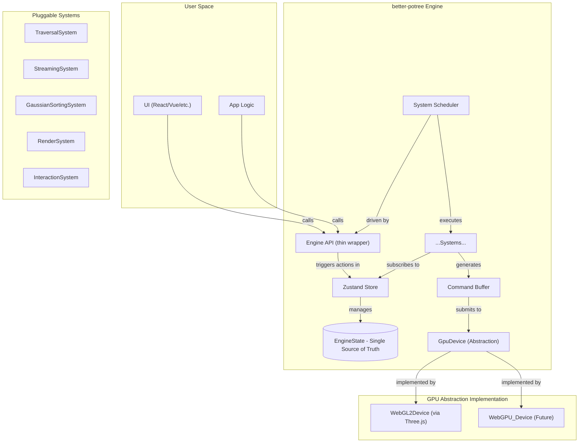
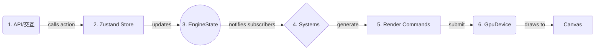
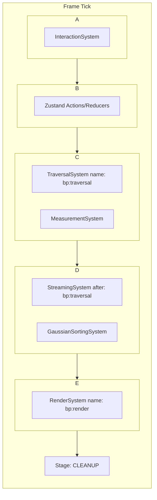

# **`better-potree`-架构设计方案**
**version**: v5.0
**desc**:Zustand 驱动的声明式 ECS 模型

## 1. 愿景与核心哲学

`better-potree` 的目标不是成为另一个"Potree 的现代化版本"，而是要成为 Web 平台**专业级、大规模空间数据可视化的首选引擎**。它专为解决 GIS、数字孪生、BIM 和自动驾驶等领域的极限挑战而生，将亿级点云和前沿的 3D Gaussian Splatting 渲染提升至新的高度。

为实现此愿景，我们选择一个**由 Zustand 驱动的、声明式的、受实体-组件-系统 (ECS) 思想启发的架构**。我们不追求"通用"，而是追求在特定领域的极致**深度、性能和可维护性**。

## 2. 核心架构原则

1.  **Zustand 驱动 (Zustand-Driven)**: 引擎的一切行为都由一个唯一的、由 `Zustand` store 管理的中央状态 (`EngineState`) 驱动。所有状态变更都通过 store 的 action 完成，实现了高效的、基于选择器的响应式更新。
2.  **声明式 API (Declarative API)**: 开发者只需描述"**我想要的最终结果是什么**"，而无需关心"**如何一步步达到这个结果**"。引擎的系统会订阅状态变化，自动且高效地执行更新。
3.  **单向数据流 (Unidirectional Data Flow)**: 状态的改变是可预测、可追溯的。数据流向永远是：**API/交互 → Store Action → 更新 State → 系统响应 → 更新渲染**。这使得调试（甚至是时间旅行调试）变得异常简单。
4.  **实体-组件-系统 (ECS-Inspired)**:
    *   **实体 (Entity)**: 场景中的一个独立"事物"（如一个点云、一个测量工具）。
    *   **组件 (Component)**: 描述实体的**纯数据**（如位置、URL、材质属性），存储在 `EngineState` 中。
    *   **系统 (System)**: 处理拥有特定组件的实体的**纯逻辑**（如遍历、加载、渲染），订阅 store 并执行副作用。
5.  **无知核心与玻璃盒 (Agnostic Core & Glass Box)**: 引擎核心对"点云"或"3DGS"等具体渲染对象一无所知。它只提供一个高效的系统调度器和渲染管线。所有特定逻辑都通过可插拔的**自定义模块**实现。我们提供清晰的扩展点，而非封闭的黑盒。
6.  **测试驱动设计 (Test-Driven by Design)**: 纯粹的数据（组件）和独立的逻辑（系统）使单元测试和测试驱动开发 (TDD) 变得简单自然，从架构层面保证了代码质量。

## 3. 整体系统架构



## 4. 核心概念详解

### 4.1 EngineState: 唯一的真理之源

`EngineState` 是一个可序列化的 TypeScript 接口，定义了渲染场景所需的一切。

```typescript
// file: packages/types/src/state.ts

/** 描述一个数据源（实体）的状态 */
export interface SourceState {
  id: string;
  type: string; // 'potree', '3dgs', or custom registered type
  url: string;
  visible?: boolean;
  transform?: number[]; // 4x4 Matrix
  materialId?: string;
  // ... 其他特定于数据源的状态
}

/** 描述视图和交互的状态 */
export interface ViewState {
  camera: {
    position: [number, number, number];
    target: [number, number, number];
    fov: number;
    // ...
  };
  controls: {
    type: 'orbit' | 'earth' | string; // 支持自定义控制器
    // ... 控制器特定配置
  };
}

/** 引擎的完整状态树 */
export interface EngineState {
  view: ViewState;
  rendering: {
    pointBudget: number;
    frameRateLimit?: number;
    // ...
  };
  /**
   * 所有数据源，以 ID 作为 key。
   * @example { 'pointcloud-1': { id: 'pc-1', type: 'potree', ... } }
   */
  sources: Record<string, SourceState>;
  
  /** 所有材质的状态 */
  materials: Record<string, Record<string, any>>;

  /** 所有交互工具的状态 */
  tools: Record<string, any>;
}
```

### 4.2 Zustand Store: 引擎的心脏

我们不再自己实现状态管理，而是完全委托给 `Zustand`。`Engine` 类本身变成了一个轻量级的协调器和 API 门面。

```typescript
// file: packages/core/src/engineStore.ts
import { createStore, StoreApi } from 'zustand/vanilla';
import { EngineState, createInitialState } from '@better-potree/types';
import { createRuntimeSlice, RuntimeSlice } from './slices/runtimeSlice';
import { createViewSlice, ViewSlice } from './slices/viewSlice';

// 将不同领域的 state 和 action 拆分到独立的 "slice" 中
export type StoreState = EngineState & RuntimeSlice & ViewSlice;

export const createEngineStore = () => 
  createStore<StoreState>()((...a) => ({
    ...createInitialState(),
    ...createRuntimeSlice(...a),
    ...createViewSlice(...a),
    // ... 其他 slices
  }));

export type EngineStore = StoreApi<StoreState>;
```

### 4.3 异步流程的优雅处理

`Zustand` 的 `async` action 完美解决了异步加载与同步状态更新的协调问题。

```typescript
// file: packages/core/src/slices/runtimeSlice.ts
import { StateCreator } from 'zustand';

// ... (NodeLoadingState interface)

export interface RuntimeSlice {
  nodes: Record<string, NodeLoadingState>;
  loadNode: (nodeId: string, url:string) => Promise<void>;
}

export const createRuntimeSlice: StateCreator<StoreState, [], [], RuntimeSlice> = (set, get) => ({
  nodes: {},
  loadNode: async (nodeId, url) => {
    const existing = get().nodes[nodeId];
    if (existing?.status === 'loading' || existing?.status === 'loaded') return;

    // 1. 同步更新：立即标记为加载中
    set(state => ({ runtime: { ...state.runtime, nodes: { ...state.runtime.nodes, [nodeId]: { status: 'loading' } } } }));

    try {
      // 2. 异步操作
      const data = await fetch(url).then(res => res.arrayBuffer());
      
      // 3. 同步更新：成功
      set(state => ({ runtime: { ...state.runtime, nodes: { ...state.runtime.nodes, [nodeId]: { status: 'loaded', data } } } }));
    } catch (error) {
      // 4. 同步更新：失败
      set(state => ({ runtime: { ...state.runtime, nodes: { ...state.runtime.nodes, [nodeId]: { status: 'failed', error: error.message } } } }));
    }
  },
});
```
*   **`TraversalSystem`** 计算出可见节点。
*   **`StreamingSystem`** 只需循环调用 `store.getState().loadNode(node.id, node.url)`。
*   **`RenderSystem`** 订阅 `store`，当节点状态变为 `loaded` 时，自动获取数据并更新 GPU 资源。

### 4.4 单向数据流

这是引擎的心跳，确保所有变化都是可预测的。



1.  **API/交互**: 用户通过 `engine.setState()` 或 `engine.actions.xxx()` 调用 store 的 action。
2.  **Zustand Store**: Store 处理 action，更新状态。
3.  **EngineState**: 状态被更新。
4.  **系统 (Systems)**: 订阅了状态特定部分的系统被通知，并执行其核心逻辑。
5.  **渲染命令 (Render Commands)**: 系统不直接调用 GPU API，而是生成一个中间指令，如 `{ type: 'DRAW_POINTS', buffer: ..., count: ... }`。
6.  **GpuDevice**: 负责解释这些命令并执行真正的 GPU 调用。

### 4.5 系统执行顺序与多阶段管线

#### 4.5.1 核心问题：隐式依赖

系统之间存在执行顺序依赖。例如:

*   **`TraversalSystem`**: 根据相机位置，计算出可见的点云节点列表。
*   **`StreamingSystem`**: 根据 `TraversalSystem` 计算出的列表，去加载新的节点。

如果 `StreamingSystem` 在 `TraversalSystem` **之前**执行，它就会基于**上一帧**的可见节点列表去工作，导致数据加载延迟一帧。这就是一个隐式的执行顺序依赖，会导致"竞争条件" (Race Condition)。

#### 4.5.2 解决方案：从"优先级"升级为"显式依赖声明"

仅仅依靠 `priority` 数字是不够的。当两个系统（特别是内置系统和用户自定义系统）使用了相同的优先级时，它们的执行顺序会退化为依赖于注册顺序，这是**不可接受的、隐式的、脆弱的**行为。

我们将 `priority` 降级为一个"粗粒度"的排序提示，并引入两个新的、更强大的元数据属性：**`before` 和 `after`**。

##### 1. 扩展 `ISystem` 接口：声明依赖

每个系统现在都必须有一个唯一的 `name`，并可以声明它必须在哪些系统之前或之后运行。

我们将引擎的每一帧（tick）划分为一系列固定的、有序的**阶段 (Stages)**。每个系统在注册时，必须**声明**自己属于哪个阶段。`SystemScheduler` 会严格按照阶段顺序来执行。

**执行阶段定义**:

| 阶段 (Stage) | 核心职责 | 典型系统 |
| :--- | :--- | :--- |
| **`INPUT`** | 接收和翻译原始用户输入 | `InteractionSystem` |
| **`STATE_UPDATE`** | 响应意图 (Intent)，更新核心状态 | (由 Zustand 的 action/reducer 隐式处理) |
| **`LOGIC`** | 执行核心业务逻辑和计算 | `TraversalSystem`, `MeasurementSystem` (计算部分) |
| **`POST_LOGIC`** | 执行依赖于最终状态的逻辑 | `StreamingSystem`, `GaussianSortingSystem` |
| **`RENDER`** | 生成渲染命令 | `RenderSystem`, `MeasurementSystem` (渲染部分) |
| **`CLEANUP`** | 帧结束时的清理工作 | (可选) |

```typescript
// file: packages/types/src/system.ts

export type SystemStage = 
  | 'INPUT' 
  | 'LOGIC' 
  | 'POST_LOGIC' 
  | 'RENDER' 
  | 'CLEANUP';

export interface ISystem {
  /**
   * 系统的唯一标识符。这是强制性的。
   * 内置系统使用 "bp:" 前缀，例如 "bp:render"。
   */
  readonly name: string;

  /**
   * 系统所属的执行阶段。
   */
  readonly stage: SystemStage;

  /**
   * (可选) 声明此系统必须在哪些系统之后运行。
   * 数组中的值为其他系统的 `name`。
   */
  readonly after?: string[];

  /**
   * (可选) 声明此系统必须在哪些系统之前运行。
   * 数组中的值为其他系统的 `name`。
   */
  readonly before?: string[];

  /**
   * 更新方法。
   */
  update(): void;
}
```

##### 2. 系统如何声明依赖（内置 vs. 自定义）

**内置 `RenderSystem` 的声明：**

```typescript
// in packages/core/src/systems/RenderSystem.ts
export class RenderSystem implements ISystem {
  public readonly name = 'bp:render'; // 使用命名空间避免冲突
  public readonly stage = 'RENDER';
  // ...
  update() { /* ... */ }
}
```

**用户自定义的"后处理"系统，它必须在渲染之后运行：**

```typescript
// in my-app/src/systems/PostProcessingSystem.ts
import { ISystem } from '@better-potree/engine';

export class PostProcessingSystem implements ISystem {
  public readonly name = 'my-app:post-processing'; // 用户也使用自己的命名空间
  public readonly stage = 'RENDER'; // 在同一阶段

  // 关键！声明一个明确的依赖关系
  public readonly after = ['bp:render']; 

  update() {
    // 这里的逻辑可以安全地假设 bp:render 已经执行完毕
  }
}
```

##### 3. `SystemScheduler` 的进化：实现拓扑排序 (Topological Sort)

`SystemScheduler` 的核心职责不再是简单的数组排序，而是要**构建一个有向无环图 (DAG)，并对其进行拓扑排序**。这是解决依赖问题的标准且最健壮的方法。

```typescript
// file: packages/core/src/SystemScheduler.ts
import { ISystem, SystemStage } from '@better-potree/types';
import { topologicalSort } from './utils/topologicalSort'; // 这是一个标准的图算法

export class SystemScheduler {
  private stages: Record<SystemStage, ISystem[]> = { /* ... */ };
  private systems: ISystem[] = [];

  constructor(initialSystems: ISystem[]) {
    initialSystems.forEach(s => this.addSystem(s));
  }

  public addSystem(system: ISystem) {
    this.systems.push(system);
    this.rebuildExecutionOrder(); // 每次添加新系统后，重新计算整个执行顺序
  }

  private rebuildExecutionOrder() {
    // 1. 按阶段分组
    const groupedByStage = this.groupSystemsByStage(this.systems);

    // 2. 对每个阶段内的系统进行拓扑排序
    for (const stage of Object.keys(this.stages)) {
      try {
        // 拓扑排序算法会根据 `before` 和 `after` 关系来确定最终顺序
        this.stages[stage] = topologicalSort(groupedByStage[stage]);
      } catch (error) {
        // 如果有循环依赖，拓扑排序会失败，我们必须抛出错误！
        console.error(`[Engine] Circular dependency detected in stage "${stage}"!`, error);
        throw new Error(`Circular dependency in systems for stage ${stage}`);
      }
    }
  }

  public run() {
    // 严格按照预设的阶段顺序执行！
    this.stages.INPUT.forEach(s => s.update());
    // (Zustand 的状态更新在这里被触发)
    this.stages.LOGIC.forEach(s => s.update());
    this.stages.POST_LOGIC.forEach(s => s.update());
    this.stages.RENDER.forEach(s => s.update());
    this.stages.CLEANUP.forEach(s => s.update());
  }
}
```

##### 4. 健壮性与开发者体验 (DX)

这个方案不仅仅是解决了技术问题，它极大地提升了架构的健壮性和开发者的体验：

1.  **冲突的解决**：
    *   **相同优先级？** 不再是问题。执行顺序由 `before`/`after` 明确定义。
    *   **没有依赖声明？** 如果两个系统在同一阶段且没有相互依赖，它们的相对顺序是不确定的，但我们**可以**使用"稳定排序"（保持注册顺序）作为后备，并**在文档中明确指出**这种不确定性。

2.  **防止错误**：
    *   **循环依赖**：如果系统 A `after` B，而系统 B `after` A，我们的 `topologicalSort` 算法会检测到这个环并**立即抛出错误**，而不是让应用在运行时出现奇怪的行为。
    *   **依赖缺失**：在 `addSystem` 时，我们可以检查 `before`/`after` 中声明的 `name` 是否都存在于已注册的系统中。如果不存在，可以打印一个**警告 `console.warn`**，提示开发者可能存在拼写错误或遗漏。

3.  **清晰的文档与 API 契约**：
    *   我们必须**在文档中清晰地列出所有内置系统的 `name`**（如 `bp:render`, `bp:traversal`）。这成为了库暴露给插件开发者的**稳定 API 的一部分**。
    *   用户自定义系统时，他们查阅文档，就能明确地将自己的系统"挂载"到引擎执行管线的精确位置。

#### 4.5.3 处理复杂场景的设计模式

##### 场景 A："我希望我的系统在某个阶段的'最开始'或'最后'运行"

**问题**：我有一个 `DebugOverlaySystem`，我希望它在 `RENDER` 阶段的**最后**运行，以确保它绘制在所有东西的最上层。我总不能 `after` 每一个可能存在的渲染系统吧？

**解决方案**：引入**"哨兵系统 (Sentinel Systems)"**或**"锚点 (Anchors)"**。

我们在引擎的核心插件中，提供一些"空"的、只作为标记的系统。

```typescript
// in packages/core-plugins/src/sentinels.ts
export const createCoreSentinels = (): Plugin[] => [
  { name: 'bp:input-start', stage: 'INPUT', update: () => {} },
  { name: 'bp:input-end', stage: 'INPUT', update: () => {} },
  { name: 'bp:logic-start', stage: 'LOGIC', update: () => {} },
  { name: 'bp:logic-end', stage: 'LOGIC', update: () => {} },
  { name: 'bp:render-start', stage: 'RENDER', update: () => {} },
  { name: 'bp:render-end', stage: 'RENDER', update: () => {} },
  // ... etc for all stages
];
```

现在，用户的 `DebugOverlaySystem` 可以这样声明：

```typescript
export class DebugOverlaySystem implements ISystem {
  public readonly name = 'my-app:debug-overlay';
  public readonly stage = 'RENDER';
  public readonly after = ['bp:render-end']; // 明确地锚定在 RENDER 阶段的末尾
}
```

##### 场景 B："两个独立的第三方插件需要协调顺序"

**问题**：我从社区下载了 `PluginA` (一个物理引擎) 和 `PluginB` (一个角色控制器)。`PluginB` 依赖 `PluginA` 的物理计算结果。但这两个插件的作者互相不认识，`PluginB` 的 `after` 列表里不可能有 `PluginA`。

**解决方案**：**依赖关系由最终的"集成者"来解决。**

这是应用开发者（库的使用者）的责任。他可以在自己的应用配置中，引入一个"胶水插件 (Glue Plugin)"或"顺序强制器 (Order Enforcer)"。

```typescript
// in my-app/src/main.ts

// 一个极小的、只用于定义顺序的插件
const PhysicsOrderEnforcerPlugin: Plugin = {
  name: 'my-app:physics-order-enforcer',
  stage: 'LOGIC', // 必须和被排序的插件在同一个 stage
  after: ['community:physics-plugin-a'], // 物理引擎
  before: ['community:character-controller-plugin-b'], // 角色控制器
  update: () => {}, // 空的 update
};

const engine = new Engine({
  plugins: [
    PhysicsPluginA(),
    CharacterControllerPluginB(),
    PhysicsOrderEnforcerPlugin, // 集成者添加这个胶水插件
  ]
});
```

**结论**：`before`/`after` 机制的强大之处在于，依赖关系可以由第三方在不修改原始插件代码的情况下注入。这保持了原始插件的解耦。

##### 场景 C："我想把我的系统插入到两个核心系统之间"

**问题**：我想开发一个 `PreStreamingCacheSystem`，它需要在 `TraversalSystem` 之后，但在 `StreamingSystem` 之前运行，来预热缓存。

**解决方案**：这是 `before`/`after` 的标准用法，也是其最强大的功能之一。

```typescript
export class PreStreamingCacheSystem implements ISystem {
  public readonly name = 'my-app:pre-stream-cache';
  public readonly stage = 'LOGIC'; // 假设 Traversal 和 Streaming 都在 LOGIC
  public readonly after = ['bp:traversal'];
  public readonly before = ['bp:streaming'];
}
```

#### 4.5.4 Order Enforcer 的风险与安全机制

##### 风险识别

`Order Enforcer` 提供了一个可以扰乱内部核心顺序的入口。它是一个"后门"，一柄双刃剑。这并非设计的疏忽，而是一个经过深思熟虑的、关于**"自由度 vs. 稳定性"**的架构权衡。

主要风险包括：

1.  **破坏核心逻辑不变性 (Violating Core Invariants)**：
    *   **灾难场景**：一个开发者不理解引擎的渲染管线，写了一个 `Order Enforcer` 强制让 `bp:render` 在 `bp:traversal` 之前运行。
    *   **结果**：引擎将永远基于上一帧的可见性数据进行渲染，导致视觉错误、性能崩溃，且 bug 极难追踪。

2.  **制造脆弱的实现依赖 (Creating Brittle Implementation Dependencies)**：
    *   **场景**：在 v1.0 中，我们的 `bp:logic` 阶段内部恰好是 A -> B -> C 的顺序。一个用户为了实现某个 hack，写了一个 enforcer 依赖于这个**未在文档中承诺**的内部顺序。
    *   **结果**：当我们发布 v1.1，出于优化重构了内部顺序为 A -> C -> B 时，这个用户的应用就会在升级后**无声地崩溃**。

##### 缓解策略：为"后门"装上"安全锁"和"警报器"

**策略一：核心依赖不可变性 (Core Dependency Immutability)**

这是最关键的安全机制。`SystemScheduler` 在构建最终执行顺序时，不仅仅是进行拓扑排序，它还要根据一组**内置的核心规则集**进行**验证**。

```typescript
// in packages/core/src/schedulerRules.ts

// 这些是引擎正常工作的基石，是不可违背的物理定律。
export const CORE_IMMUTABLE_RULES = [
  // 规则：'bp:streaming' 必须在 'bp:traversal' 之后
  { after: 'bp:traversal', before: 'bp:streaming' },
  
  // 规则：'bp:render' 必须在 'bp:traversal' 之后
  { after: 'bp:traversal', before: 'bp:render' },
  
  // 规则：'bp:sorting' 必须在 'bp:streaming' 之后但在 'bp:render' 之前
  { after: 'bp:streaming', before: 'bp:sorting' },
  { after: 'bp:sorting', before: 'bp:render' },
];

// in SystemScheduler.ts
private rebuildExecutionOrder() {
  // ... (进行拓扑排序得到 finalOrder)
  
  // 关键！验证最终顺序是否违反了核心规则
  if (!this.validateOrderAgainstRules(finalOrder, CORE_IMMUTABLE_RULES)) {
    // 如果违反，立即抛出致命错误，并清晰地指出哪条规则被违反了
    throw new Error(`Fatal: The final system order violates a core engine invariant. 
      For example, 'bp:render' is scheduled before 'bp:traversal'. 
      This is likely caused by a misconfigured Order Enforcer plugin.`);
  }

  this.stages = ... // 存储最终顺序
}
```

**效果**：
*   用户**可以**使用 `Order Enforcer` 来排序两个第三方插件。
*   用户**可以**将自己的插件插入到 `bp:traversal` 和 `bp:streaming` 之间。
*   但用户**绝不可能**将 `bp:streaming` 排到 `bp:traversal` 之前。如果他们尝试这么做，引擎会在初始化时就**崩溃并报错**，而不是在运行时产生奇怪的行为。

**策略二：文档与警告**

1.  **文档**：`Order Enforcer` 必须拥有最高级别的文档警告。用红色、加粗的字体标明这是一个"专家级"功能，滥用会导致应用不稳定，并链接到核心的不可变规则列表。
2.  **运行时警告**：当 `Engine` 检测到用户插件列表中存在一个修改了核心插件顺序（即 `before`/`after` 包含了 `bp:` 前缀的插件）的 `Order Enforcer` 时，在控制台打印一条 `console.warn`：
    ```
    [better-potree] Warning: An Order Enforcer plugin ('my-app:enforcer') is modifying the execution order of core engine systems. This is a powerful feature intended for expert use. Ensure you understand the core execution pipeline to avoid unpredictable behavior.
    ```

#### 4.5.5 高级方案：系统标签 (System Labels)

`before`/`after` 依赖于具体的系统 `name`。当系统数量非常多时，维护这些依赖关系会变得繁琐。现代游戏引擎如 Bevy 引入了一个更高级的抽象：**标签 (Label)** 或 **系统集 (System Set)**。

这是一个可选的、更高级的演进方向，可以解决"依赖于一类系统，而不是一个具体系统"的问题。

```typescript
// 1. 扩展 ISystem 接口
export interface ISystem {
  name: string;
  stage: SystemStage;
  labels?: string[]; // 系统可以给自己贴上多个标签
  after?: (string | string[])[]; // 可以依赖于 name 或 label
  before?: (string | string[])[];
}

// 2. 核心系统打上标签
// TraversalSystem: labels: ['bp:core', 'bp:visibility']
// RenderSystem: labels: ['bp:core', 'bp:rendering']

// 3. 用户可以依赖于标签
export class MyCustomGameplaySystem implements ISystem {
  name: 'my-app:gameplay';
  stage: 'LOGIC';
  // 我不关心具体的 visibility 系统是什么，我只想在所有 visibility 计算之后运行
  after: [['bp:visibility']]; // 用数组表示这是一个标签
}
```

`SystemScheduler` 的拓扑排序算法需要被扩展，以支持解析这些标签依赖。

**这个高级方案的优势**：
*   **高度解耦**：系统之间不再需要知道彼此的具体名称，而是通过共享的"标签"来通信。
*   **更强的分组能力**：我们可以定义"在所有物理系统之后运行"或"在所有UI系统之前运行"，极大地简化了复杂场景的依赖管理。

#### 4.5.6 执行管线流程图



#### 4.5.7 最终裁定与设计优势

**`before`/`after` 机制是否足够？**

*   **是的，对于 95% 的场景，它是完全足够的**。通过辅以"哨兵系统"和"胶水插件"的设计模式，它可以解决几乎所有可预见的工程问题。它的明确性和简单性是一个巨大的优点。

**核心风险：**

*   **知识传递**：它的有效性，依赖于库的使用者理解这些设计模式。这就要求我们必须提供**极其出色、包含大量实例的文档**，来教育用户如何正确地解决依赖问题。
*   **字符串依赖**：依赖是基于字符串 `name` 的。拼写错误不会在编译时被发现，只能在运行时由调度器报错。这是其固有的缺点。

**决策建议：**

*   **启动时**：**从 `before`/`after` + 哨兵系统开始**。这个方案已经非常强大，且易于理解和实现。
*   **文档先行**：在实现的同时，就要开始撰写关于系统依赖管理的**最佳实践文档**。
*   **保留进化空间**：在设计 `SystemScheduler` 时，就要考虑到未来可能引入"系统集 (System Sets)"的需求，为这个更高级的抽象预留接口。

**设计优势总结：**

1.  **从"脆弱的约定"到"坚固的契约"**：通过引入**唯一的系统名称**和**`before`/`after` 依赖声明**，并使用**拓扑排序**来构建执行管线，我们彻底解决了执行顺序的冲突问题。
2.  **宏观顺序保证**：**阶段 (Stage)** 确保了不同职责的系统总是在正确的宏观顺序上执行。
3.  **微观顺序控制**：**依赖声明**解决了在同一个阶段内可能存在的依赖问题。
4.  **符合开闭原则**：当业务开发者添加自定义系统时，他们**必须**为其指定 `stage` 和依赖关系，这强制他们思考自己的系统应该在数据流的哪个环节工作。
5.  **架构清晰性**：这个管线模型本身就成为了一个强大的架构文档，清晰地展示了每一帧的数据是如何产生、转换、并最终被渲染出来的。

这个方案在**实用性、可实现性和未来可扩展性**之间取得了最佳的平衡。它能让您立即构建一个健壮的系统，同时也为应对未来更复杂的挑战铺平了道路。

## 5. 模块划分与职责

| 包名 | 核心职责 | 依赖 |
| :--- | :--- | :--- |
| **`@better-potree/types`** | 定义所有共享的 TS 接口和类型 (`EngineState`, `ISystem` 等)。 | (无) |
| **`@better-potree/math`** | 提供数学库（Vector3, Matrix4）。初期可封装 Three.js 数学库。 | `three` (仅数学部分) |
| **`@better-potree/core`** | **包含 `Zustand` store 的创建与管理**，所有内置系统和 `SystemScheduler`。 | `types`, `math`, `zustand` |
| **`@better-potree/device-webgl2`** | `GpuDevice` 接口的 WebGL2 实现层，内部使用 Three.js。 | `three` |
| **`@better-potree/loader-potree`** | `ILoader` 接口的 Potree 格式实现。 | `types` |
| **`@better-potree/loader-3dgs`** | `ILoader` 接口的 3DGS (SOG) 格式实现。 | `types` |
| **`@better-potree/controls`** | 提供可插拔的相机控制器（迁移自 Potree）。 | `types`, `math` |
| **`@better-potree/engine`** | **项目主入口**。组合所有核心包，创建 `store`，初始化 `SystemScheduler`，并暴露最终的、简洁的 `Engine` API 类。 | (所有核心包) |
| **`@better-potree/playground`** | 开发示例、调试和性能测试。 | `engine` |

## 6. 强大的可扩展性模型

引擎通过以下"扩展点"实现从"黑盒"到"玻璃盒"的转变，所有扩展点都与 `Zustand` store 深度集成：

1.  **自定义材质/着色器**: 通过 `engine.registerMaterial('my-material', MyMaterial)` 注册自定义材质类，然后在 `SourceState` 中通过 `materialId` 引用。
2.  **自定义数据加载**: 通过 `engine.registerLoader('my-format', MyLoader)` 注册新的加载器，然后在 `SourceState` 中通过 `type: 'my-format'` 使用。
3.  **自定义交互工具**: 通过 `engine.addSystem(new MyCustomToolSystem(store))` 注入新的系统。自定义系统在构造时接收 `store` 实例，使其能订阅状态和派发 action。
4.  **自定义核心算法**: 通过 `engine.addSystem(new MyTraversalSystem(store, new MyCustomStrategy()))` 来替换默认的核心算法。策略模式可以与系统注入结合。

## 7. API 设计示例 (Zustand 驱动版)

`Engine` 类现在是一个非常轻的包装器。

```typescript
// file: packages/engine/src/Engine.ts
import { createEngineStore, EngineStore } from '@better-potree/core';
import { WebGL2Device } from '@better-potree/device-webgl2';

export class Engine {
  public store: EngineStore;
  private scheduler: SystemScheduler;
  
  constructor(config: EngineConfig) {
    this.store = createEngineStore();
    this.scheduler = new SystemScheduler(this.store, [
      new TraversalSystem(),
      new StreamingSystem(),
      new RenderSystem(config.canvas),
      // ...
    ]);
    
    // 启动渲染循环
    this.start();
  }
  
  private start() {
    const loop = () => {
      this.scheduler.run();
      requestAnimationFrame(loop);
    };
    loop();
  }
  
  // API 就是 store actions 的别名，提供类型安全
  setState = (partialState) => this.store.getState().set(partialState);
  
  subscribe = (selector, callback, options) => this.store.subscribe(selector, callback, options);
  
  // 方便地访问 actions
  get actions() {
    return this.store.getState();
  }
}
```

**使用示例**:

```typescript
import { Engine, WebGL2Device } from '@better-potree/engine';

// 1. 初始化引擎，注入 GPU Device 实现
const engine = new Engine({
  canvas: document.getElementById('render-canvas'),
  device: new WebGL2Device({ antialias: true }),
});

// 2. 声明场景的初始状态
engine.setState({
  view: {
    camera: {
      position: [100, 100, 100],
      target: [0, 0, 0],
      fov: 60,
    },
    controls: { type: 'orbit' },
  },
  rendering: {
    pointBudget: 2_000_000,
  },
  sources: {
    'stanford-dragon': {
      id: 'stanford-dragon',
      type: 'potree',
      url: 'path/to/dragon/cloud.js',
      materialId: 'default-point-material', // 引用材质
    },
    'gaussian-splat': {
        id: 'gaussian-splat',
        type: '3dgs',
        url: 'path/to/splat.sog',
    }
  },
  materials: {
      'default-point-material': {
          size: 1.2,
          encoding: 'RGB',
      }
  }
});

// 3. 调用封装好的异步 action
engine.actions.loadNode('node-id', 'node-url');

// 4. 监听状态变化来更新 UI
engine.subscribe(
  (state) => state.tools.measurement?.distance, // Selector function
  (distance) => {
    document.getElementById('distance-label').innerText = distance?.toFixed(2) || '0';
  }
);

// 5. 订阅节点加载状态
const unsub = engine.subscribe(
  state => state.runtime.nodes['node-id']?.status,
  status => console.log('Node status changed:', status)
);
```

## 8. 实施路线图 (已更新)

*   **阶段 0: 基础建设 (1周)**
    *   搭建 Monorepo, TS, Rsbuild, Vitest, Biome 环境。
    *   创建所有模块包结构。
    *   **核心任务**: 安装 `zustand`。定义 `EngineState` 和 store slices 的基本结构 (`createEngineStore`)。
    *   **完成**: `EngineState` 核心接口的定义与团队评审。

*   **阶段 1: MVP - "Hello, Point!" (2-3周)**
    *   实现最简 `Engine`、`GpuDevice` 接口和 `WebGL2Device` 实现。
    *   实现一个能加载并渲染**单个**点云节点的极简 `PotreeLoader` 和 `RenderSystem`。
    *   **核心任务**: 在 `runtimeSlice` 中实现一个极简的 `loadNode` action，打通**异步加载 -> 状态更新 -> 系统响应**的完整数据流。
    *   **完成**: 通过一次 `setState` 调用，在屏幕上渲染出静态的点。

*   **阶段 2: 流式加载与交互 (3-4周)**
    *   迁移 Potree 的相机控制器 (`controls` 包)。
    *   将相机状态纳入 `EngineState`。
    *   **核心任务**: 实现 `TraversalSystem` (视锥剔除, LOD选择) 和 `StreamingSystem` (优先级队列, 预算管理)。
    *   **完成**: 可以在场景中自由漫游，点云按需动态加载，LOD 平滑过渡。后续阶段的实现将更加顺畅，因为我们有了一个强大且可预测的状态管理核心。系统之间的协调将通过订阅 store 和调用 action 来完成，而不是通过复杂的事件或回调。

*   **阶段 3: 高级功能与工具 (2-3周)**
    *   设计并实现 `MeasurementSystem` 和 `ClippingSystem`。
    *   设计并实现 `InteractionSystem`，将 DOM 事件转换为 store actions。
    *   完善 `engine.subscribe` API，支持细粒度的状态订阅。
    *   **完成**: 实现一个功能完整的、无 UI 依赖的测量工具。

*   **阶段 4: 3DGS 集成 (3-4周)**
    *   实现 `@better-potree/loader-3dgs`。
    *   **核心任务**: 实现 `GaussianSortingSystem`，支持 WASM 和 WebGPU 排序策略。
    *   扩展 `RenderSystem` 以支持 3DGS 渲染命令。
    *   **完成**: 可以在同一场景中无缝渲染点云和流式加载的 3DGS 数据。

*   **阶段 5: 完善与生态 (持续)**
    *   编写详尽的 API 文档和示例。
    *   性能分析与优化。
    *   开发 UI 适配器，如 `@better-potree/react`（可选）。

## 9. 风险评估 (已更新)

*   **团队学习曲线 (中)**: 风险从"理解复杂的声明式概念"转变为"学习并遵循 Zustand 的最佳实践"。后者有大量社区文档支持，风险显著降低。
    *   **缓解**: 在阶段 1 MVP 过程中进行团队培训和结对编程，确保核心概念被充分理解。提供 Zustand 最佳实践文档和示例代码。
*   **性能开销 (低)**: Zustand 经过高度优化，其开销极小。我们规避了自己实现状态管理可能带来的性能陷阱。
    *   **缓解**: 保持 `System` 逻辑高效，使用 Zustand 的选择器优化来避免不必要的重渲染，对性能关键路径进行严格的基准测试。
*   **状态管理库锁定 (低)**: Zustand 是一个极简的库。其核心思想（action/selector）是通用的。未来即便要替换，由于逻辑都封装在 slice 和 system 中，迁移成本也是可控的。
*   **过度工程化 (中)**: 避免陷入不必要的抽象。
    *   **缓解**: 严格遵循 TDD 和 YAGNI ("You Ain't Gonna Need It") 原则，只有在测试需要或功能明确要求时才添加新代码。
