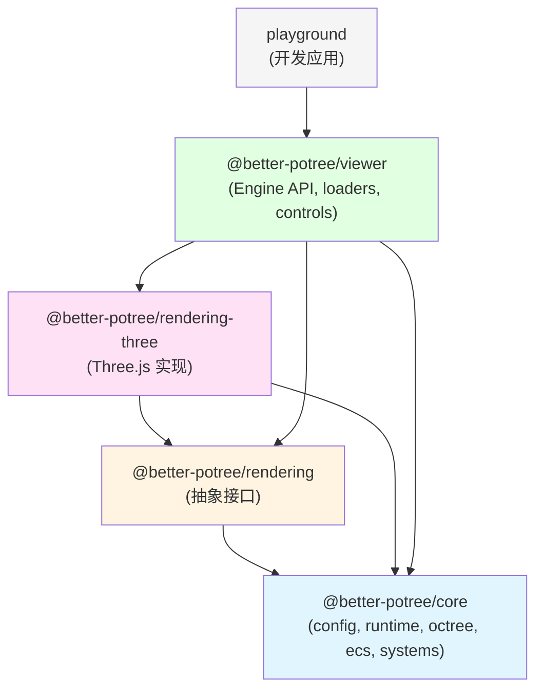

# **better-potree 包重构计划**

**版本**: v1.0
**日期**: 2025-11-16
**状态**: ✅ 已批准实施

---

## 📋 目录

1. [重构背景](#1-重构背景)
2. [问题分析](#2-问题分析)
3. [新的包结构](#3-新的包结构)
4. [包职责定义](#4-包职责定义)
5. [依赖关系图](#5-依赖关系图)
6. [迁移路径](#6-迁移路径)
7. [实施计划](#7-实施计划)
8. [验证标准](#8-验证标准)

---

## 1. 重构背景

### 1.1 原方案的问题

原架构方案(v8.0)定义了8个包:

```
packages/
├── types/              # @better-potree/types
├── config/             # @better-potree/config
├── core/               # @better-potree/core
├── rendering-three/    # @better-potree/rendering-three
├── loaders/            # @better-potree/loaders
├── controls/           # @better-potree/controls
├── tools/              # @better-potree/tools
└── viewer/             # @better-potree/viewer
```

**主要问题**:

1. ❌ **包划分过细** - 8个包对于初期项目来说过于复杂
2. ❌ **职责不清** - `loaders`, `tools`, `controls` 的定位模糊
3. ❌ **维护成本高** - 每个包都需要独立的配置、构建、测试
4. ❌ **缺少测试组织** - 集成测试和共享测试工具没有明确位置
5. ❌ **文档分散** - API 文档和架构文档的组织不清晰

### 1.2 重构目标

- ✅ **简化包结构** - 从8个包减少到4个核心包
- ✅ **明确职责边界** - 清晰的分层: core → rendering → rendering-three → viewer
- ✅ **降低初期复杂度** - 便于快速迭代和 POC 验证
- ✅ **保留可扩展性** - 未来可以按需拆分新包
- ✅ **统一测试组织** - 独立的测试目录,支持单元测试和集成测试
- ✅ **明确文档位置** - 独立的文档目录,便于维护

---

## 2. 问题分析

### 2.1 当前包的问题分析

| 包名 | 问题 | 建议 |
|------|------|------|
| `@better-potree/types` | 太小,只有类型定义,没必要独立 | 合并到 `core` |
| `@better-potree/config` | 与 `core` 强耦合,单独包没有意义 | 合并到 `core` |
| `@better-potree/core` | ✅ 核心包,保留 | 保留,扩充功能 |
| `@better-potree/rendering-three` | ✅ 渲染实现,保留 | 保留 |
| `@better-potree/loaders` | 只有加载器逻辑,太小 | 合并到 `viewer` |
| `@better-potree/controls` | 相机控制,与 `viewer` 强相关 | 合并到 `viewer` |
| `@better-potree/tools` | 定义模糊,不知道包含什么 | 如果是开发工具,放根目录 |
| `@better-potree/viewer` | ✅ 高级 API,保留 | 保留,扩充功能 |

### 2.2 分层边界模糊的问题

```typescript
// 问题示例: RenderSystem 应该放在哪里?
// 选项1: 放在 core 中 → 但它依赖具体的渲染后端 (Three.js)
// 选项2: 放在 rendering-three 中 → 但它是核心系统的一部分

// 原方案没有解决这个问题!
```

**解决方案**: 引入 `@better-potree/rendering` 抽象层

- `core` 中的 `RenderSystem` 只负责协调,不涉及具体渲染
- `rendering` 定义渲染接口 (`IRenderer`, `IMaterial`, `IBuffer`)
- `rendering-three` 实现这些接口

---

## 3. 新的包结构

### 3.1 完整目录结构

```
better-potree/
├── packages/
│   ├── core/                              # @better-potree/core
│   │   ├── src/
│   │   │   ├── config/                    # ConfigStore (Zustand)
│   │   │   │   ├── store.ts
│   │   │   │   ├── types.ts
│   │   │   │   └── index.ts
│   │   │   ├── runtime/                   # Runtime 类
│   │   │   │   ├── Runtime.ts
│   │   │   │   ├── LoadTask.ts
│   │   │   │   └── index.ts
│   │   │   ├── coordinator/               # StateCoordinator
│   │   │   │   ├── StateCoordinator.ts
│   │   │   │   └── index.ts
│   │   │   ├── octree/                    # OctreeManager, OctreeNode
│   │   │   │   ├── OctreeManager.ts
│   │   │   │   ├── OctreeNode.ts
│   │   │   │   └── index.ts
│   │   │   ├── ecs/                       # ECSWorld, components
│   │   │   │   ├── ECSWorld.ts
│   │   │   │   ├── components.ts
│   │   │   │   └── index.ts
│   │   │   ├── systems/                   # 核心系统
│   │   │   │   ├── TraversalSystem.ts
│   │   │   │   ├── StreamingSystem.ts
│   │   │   │   ├── RenderCoordinatorSystem.ts  # 渲染协调,不涉及具体渲染
│   │   │   │   └── index.ts
│   │   │   ├── resources/                 # 资源管理
│   │   │   │   ├── ResourceManager.ts
│   │   │   │   ├── WorkerPool.ts
│   │   │   │   ├── ObjectPools.ts
│   │   │   │   ├── MessageQueue.ts
│   │   │   │   └── index.ts
│   │   │   ├── scheduler/                 # SystemScheduler
│   │   │   │   ├── SystemScheduler.ts
│   │   │   │   └── index.ts
│   │   │   ├── types/                     # 核心类型定义
│   │   │   │   ├── system.ts
│   │   │   │   ├── config.ts
│   │   │   │   ├── runtime.ts
│   │   │   │   └── index.ts
│   │   │   └── index.ts                   # 包导出
│   │   ├── tests/
│   │   │   ├── config.test.ts
│   │   │   ├── runtime.test.ts
│   │   │   ├── coordinator.test.ts
│   │   │   ├── octree.test.ts
│   │   │   ├── ecs.test.ts
│   │   │   └── systems.test.ts
│   │   ├── package.json
│   │   ├── tsconfig.json
│   │   └── README.md
│   │
│   ├── rendering/                         # @better-potree/rendering (抽象层)
│   │   ├── src/
│   │   │   ├── interfaces/
│   │   │   │   ├── IRenderer.ts           # 渲染器接口
│   │   │   │   ├── IMaterial.ts           # 材质接口
│   │   │   │   ├── IBuffer.ts             # 缓冲区接口
│   │   │   │   ├── IShader.ts             # 着色器接口
│   │   │   │   └── index.ts
│   │   │   ├── systems/
│   │   │   │   ├── RenderSystem.ts        # 抽象的 RenderSystem
│   │   │   │   └── index.ts
│   │   │   ├── types/
│   │   │   │   ├── rendering.ts
│   │   │   │   └── index.ts
│   │   │   └── index.ts
│   │   ├── tests/
│   │   │   └── interfaces.test.ts
│   │   ├── package.json
│   │   ├── tsconfig.json
│   │   └── README.md
│   │
│   ├── rendering-three/                   # @better-potree/rendering-three
│   │   ├── src/
│   │   │   ├── ThreeRenderer.ts           # IRenderer 的 Three.js 实现
│   │   │   ├── materials/
│   │   │   │   ├── PointCloudMaterial.ts
│   │   │   │   ├── GaussianSplatMaterial.ts
│   │   │   │   └── index.ts
│   │   │   ├── shaders/
│   │   │   │   ├── pointcloud.vert.glsl
│   │   │   │   ├── pointcloud.frag.glsl
│   │   │   │   ├── gaussian.vert.glsl
│   │   │   │   ├── gaussian.frag.glsl
│   │   │   │   └── index.ts
│   │   │   ├── buffers/
│   │   │   │   ├── PointBuffer.ts
│   │   │   │   └── index.ts
│   │   │   ├── ThreeRenderSystem.ts       # RenderSystem 的 Three.js 实现
│   │   │   └── index.ts
│   │   ├── tests/
│   │   │   ├── renderer.test.ts
│   │   │   └── materials.test.ts
│   │   ├── package.json
│   │   ├── tsconfig.json
│   │   └── README.md
│   │
│   └── viewer/                            # @better-potree/viewer
│       ├── src/
│       │   ├── Engine.ts                  # 主引擎 API
│       │   ├── loaders/                   # 数据加载器
│       │   │   ├── PotreeLoader.ts
│       │   │   ├── GaussianSplatLoader.ts
│       │   │   ├── decoder.worker.ts
│       │   │   └── index.ts
│       │   ├── controls/                  # 相机控制
│       │   │   ├── OrbitControls.ts
│       │   │   ├── FirstPersonControls.ts
│       │   │   └── index.ts
│       │   ├── ui/                        # UI 组件(可选)
│       │   │   ├── PerformancePanel.ts
│       │   │   ├── SettingsPanel.ts
│       │   │   └── index.ts
│       │   └── index.ts
│       ├── tests/
│       │   ├── engine.test.ts
│       │   ├── loaders.test.ts
│       │   └── controls.test.ts
│       ├── package.json
│       ├── tsconfig.json
│       └── README.md
│
├── apps/
│   └── playground/                        # 开发和演示应用
│       ├── src/
│       │   ├── main.ts
│       │   ├── examples/
│       │   │   ├── basic.ts
│       │   │   ├── multiple-sources.ts
│       │   │   └── performance.ts
│       │   └── index.html
│       ├── public/
│       │   └── assets/
│       ├── package.json
│       └── rsbuild.config.ts
│
├── tests/
│   ├── integration/                       # 跨包集成测试
│   │   ├── full-pipeline.test.ts          # 完整流程测试
│   │   ├── multi-source.test.ts           # 多数据源测试
│   │   └── performance.test.ts            # 性能测试
│   ├── e2e/                               # 端到端测试
│   │   ├── basic-rendering.spec.ts
│   │   └── user-interactions.spec.ts
│   ├── fixtures/                          # 测试数据
│   │   ├── pointclouds/
│   │   │   ├── small-test.json
│   │   │   └── cloud.js
│   │   └── mocks/
│   │       ├── mock-octree.ts
│   │       └── mock-renderer.ts
│   └── utils/                             # 测试工具
│       ├── test-helpers.ts
│       └── performance-helpers.ts
│
├── docs/
│   ├── api/                               # API 文档
│   │   ├── core.md
│   │   ├── rendering.md
│   │   ├── rendering-three.md
│   │   └── viewer.md
│   ├── guides/                            # 使用指南
│   │   ├── getting-started.md
│   │   ├── loading-pointclouds.md
│   │   ├── custom-materials.md
│   │   └── performance-tuning.md
│   └── architecture/                      # 架构文档
│       ├── overview.md
│       ├── state-management.md
│       ├── rendering-pipeline.md
│       └── octree-system.md
│
├── dev_docs/                              # 开发文档
│   ├── architecture-v8.md                 # 主架构文档
│   └── package-restructure-plan.md        # 本文档
│
├── scripts/                               # 工具脚本
│   ├── setup.sh
│   ├── build-all.sh
│   └── test-all.sh
│
├── pnpm-workspace.yaml
├── package.json
├── tsconfig.json
├── tsconfig.build.json
├── vitest.config.ts
├── vitest.workspace.ts
├── rsbuild.config.ts
├── biome.json
├── .gitignore
├── LICENSE
└── README.md
```

### 3.2 包数量对比

| 维度 | 原方案 | 新方案 | 变化 |
|------|--------|--------|------|
| 核心包数量 | 8 | 4 | -50% |
| 需要独立配置的包 | 8 | 4 | -50% |
| 包间依赖关系数 | 12+ | 6 | -50% |
| 初期维护成本 | 高 | 中 | ⬇️ |

---

## 4. 包职责定义

### 4.1 @better-potree/core

**职责**: 引擎核心逻辑,与渲染后端无关

**包含内容**:
- ✅ 配置管理 (`config/`) - ConfigStore, 类型定义
- ✅ 运行时状态 (`runtime/`) - Runtime 类
- ✅ 状态协调 (`coordinator/`) - StateCoordinator
- ✅ 八叉树系统 (`octree/`) - OctreeManager, OctreeNode
- ✅ ECS 系统 (`ecs/`) - ECSWorld, 组件定义
- ✅ 核心系统 (`systems/`) - TraversalSystem, StreamingSystem, RenderCoordinatorSystem
- ✅ 资源管理 (`resources/`) - ResourceManager, WorkerPool, ObjectPools, MessageQueue
- ✅ 系统调度 (`scheduler/`) - SystemScheduler
- ✅ 类型定义 (`types/`) - 所有核心类型

**导出示例**:
```typescript
// packages/core/src/index.ts
export * from './config';
export * from './runtime';
export * from './coordinator';
export * from './octree';
export * from './ecs';
export * from './systems';
export * from './resources';
export * from './scheduler';
export * from './types';
```

**依赖**:
- `zustand` - 状态管理
- `three` - 只用于类型 (Vector3, Matrix4, Box3 等)

**不依赖**:
- ❌ 任何具体的渲染库 (除类型外)
- ❌ DOM API

### 4.2 @better-potree/rendering

**职责**: 渲染抽象层,定义渲染接口

**包含内容**:
- ✅ 渲染器接口 (`interfaces/IRenderer.ts`)
- ✅ 材质接口 (`interfaces/IMaterial.ts`)
- ✅ 缓冲区接口 (`interfaces/IBuffer.ts`)
- ✅ 着色器接口 (`interfaces/IShader.ts`)
- ✅ 抽象的 RenderSystem (`systems/RenderSystem.ts`)

**接口定义示例**:
```typescript
// packages/rendering/src/interfaces/IRenderer.ts
export interface IRenderer {
  initialize(canvas: HTMLCanvasElement): Promise<void>;
  render(nodes: RenderableNode[]): void;
  resize(width: number, height: number): void;
  dispose(): void;

  // 资源管理
  createBuffer(data: ArrayBuffer, type: BufferType): IBuffer;
  createMaterial(config: MaterialConfig): IMaterial;

  // 统计信息
  getStats(): RenderStats;
}

export interface RenderableNode {
  nodeId: string;
  buffer: IBuffer;
  material: IMaterial;
  transform: Matrix4;
  numPoints: number;
}

export interface RenderStats {
  drawCalls: number;
  pointsRendered: number;
  gpuMemoryUsed: number;
}
```

**依赖**:
- `@better-potree/core` - 核心类型

**不依赖**:
- ❌ 任何具体的渲染库

### 4.3 @better-potree/rendering-three

**职责**: Three.js 渲染实现

**包含内容**:
- ✅ ThreeRenderer - IRenderer 的 Three.js 实现
- ✅ 材质实现 (`materials/`) - PointCloudMaterial, GaussianSplatMaterial
- ✅ 着色器 (`shaders/`) - GLSL 着色器代码
- ✅ 缓冲区实现 (`buffers/`) - Three.js BufferGeometry 封装
- ✅ ThreeRenderSystem - RenderSystem 的 Three.js 实现

**实现示例**:
```typescript
// packages/rendering-three/src/ThreeRenderer.ts
import { IRenderer, RenderableNode } from '@better-potree/rendering';
import { WebGLRenderer, Scene, Camera } from 'three';

export class ThreeRenderer implements IRenderer {
  private renderer: WebGLRenderer;
  private scene: Scene;

  async initialize(canvas: HTMLCanvasElement): Promise<void> {
    this.renderer = new WebGLRenderer({ canvas });
    this.scene = new Scene();
  }

  render(nodes: RenderableNode[]): void {
    // 实现具体的渲染逻辑
    for (const node of nodes) {
      // 添加到场景并渲染
    }
    this.renderer.render(this.scene, camera);
  }

  // ... 其他方法实现
}
```

**依赖**:
- `@better-potree/core` - 核心类型
- `@better-potree/rendering` - 渲染接口
- `three` - Three.js 库

### 4.4 @better-potree/viewer

**职责**: 高级 API 和用户功能

**包含内容**:
- ✅ Engine 类 - 主引擎 API,组装所有组件
- ✅ 加载器 (`loaders/`) - PotreeLoader, GaussianSplatLoader, decoder.worker
- ✅ 相机控制 (`controls/`) - OrbitControls, FirstPersonControls
- ✅ UI 组件 (`ui/`) - PerformancePanel, SettingsPanel (可选)

**Engine 实现示例**:
```typescript
// packages/viewer/src/Engine.ts
import { Runtime, StateCoordinator, SystemScheduler, OctreeManager, ResourceManager, ECSWorld } from '@better-potree/core';
import { ThreeRenderer, ThreeRenderSystem } from '@better-potree/rendering-three';
import { createConfigStore } from '@better-potree/core/config';

export class Engine {
  private configStore: ConfigStore;
  private runtime: Runtime;
  private coordinator: StateCoordinator;
  private scheduler: SystemScheduler;
  private renderer: ThreeRenderer;
  private octreeManager: OctreeManager;
  private resourceManager: ResourceManager;
  private ecs: ECSWorld;

  constructor(config: EngineConfig) {
    // 初始化所有组件
    this.configStore = createConfigStore(config);
    this.runtime = new Runtime();
    this.renderer = new ThreeRenderer();
    this.octreeManager = new OctreeManager();
    this.resourceManager = new ResourceManager(this.runtime.budgets.gpuMemory);
    this.ecs = new ECSWorld();

    // 组装引擎 - StateCoordinator 需要 5 个参数
    this.coordinator = new StateCoordinator(
      this.configStore,
      this.runtime,
      this.octreeManager,
      this.resourceManager,
      this.ecs
    );

    this.scheduler = new SystemScheduler(this.runtime);
    this.registerSystems();
  }

  private registerSystems(): void {
    this.scheduler.register(new TraversalSystem(this.runtime, this.octreeManager));
    this.scheduler.register(new StreamingSystem(this.runtime, workerPool, messageQueue));
    this.scheduler.register(new ThreeRenderSystem(this.runtime, this.renderer));
  }

  // 用户 API
  addSource(config: SourceConfig): void {
    this.configStore.getState().addSource(config);
  }

  start(): void {
    this.coordinator.initialSync(); // 初始同步 sources, rendering, camera
    this.scheduler.start();
    this.startRenderLoop();
  }

  // ... 其他公共 API
}
```

**依赖**:
- `@better-potree/core` - 核心引擎
- `@better-potree/rendering` - 渲染接口
- `@better-potree/rendering-three` - Three.js 渲染实现

---

## 5. 依赖关系图

### 5.1 包依赖关系



### 5.2 依赖关系表

| 包 | 依赖 | 原因 |
|---|------|------|
| `@better-potree/core` | `zustand`, `three`(类型) | 状态管理 + 数学类型 |
| `@better-potree/rendering` | `@better-potree/core` | 核心类型 |
| `@better-potree/rendering-three` | `@better-potree/core`<br/>`@better-potree/rendering`<br/>`three` | 实现渲染接口 |
| `@better-potree/viewer` | `@better-potree/core`<br/>`@better-potree/rendering`<br/>`@better-potree/rendering-three` | 组装完整引擎 |

### 5.3 分层示意图

```
┌─────────────────────────────────────────────────┐
│  @better-potree/viewer                          │  ← 用户层
│  (Engine API, loaders, controls)                │
└─────────────────────────────────────────────────┘
                    ↓
┌─────────────────────────────────────────────────┐
│  @better-potree/rendering-three                 │  ← 实现层
│  (Three.js 渲染实现)                            │
└─────────────────────────────────────────────────┘
                    ↓
┌─────────────────────────────────────────────────┐
│  @better-potree/rendering                       │  ← 抽象层
│  (渲染接口定义)                                 │
└─────────────────────────────────────────────────┘
                    ↓
┌─────────────────────────────────────────────────┐
│  @better-potree/core                            │  ← 核心层
│  (config, runtime, octree, ecs, systems)        │
└─────────────────────────────────────────────────┘
```

---

## 6. 迁移路径

### 6.1 原包内容迁移映射

| 原包 | 新位置 | 迁移说明 |
|------|--------|----------|
| `@better-potree/types` | `@better-potree/core/types` | 合并到 core |
| `@better-potree/config` | `@better-potree/core/config` | 合并到 core |
| `@better-potree/core` | `@better-potree/core` | 保留,扩充内容 |
| `@better-potree/loaders` | `@better-potree/viewer/loaders` | 合并到 viewer |
| `@better-potree/controls` | `@better-potree/viewer/controls` | 合并到 viewer |
| `@better-potree/tools` | 根目录 `scripts/` | 开发工具移到根目录 |
| `@better-potree/rendering-three` | `@better-potree/rendering-three` | 保留 |
| `@better-potree/viewer` | `@better-potree/viewer` | 保留,扩充内容 |
| (新增) | `@better-potree/rendering` | 新增抽象层 |

### 6.2 导入路径变化

**原代码**:
```typescript
import { SourceConfig } from '@better-potree/types';
import { createConfigStore } from '@better-potree/config';
import { Runtime } from '@better-potree/core';
import { PotreeLoader } from '@better-potree/loaders';
```

**新代码**:
```typescript
import { SourceConfig, createConfigStore, Runtime } from '@better-potree/core';
import { PotreeLoader } from '@better-potree/viewer';
```

### 6.3 RenderSystem 的迁移

**原方案 (有问题)**:
```typescript
// packages/core/src/systems/RenderSystem.ts
// 问题: 这里会依赖 Three.js 的具体实现
export class RenderSystem implements ISystem {
  update(deltaTime: number): void {
    // 依赖 Three.js 的代码...
  }
}
```

**新方案 (解决方案)**:
```typescript
// packages/core/src/systems/RenderCoordinatorSystem.ts
// 只负责协调,不涉及具体渲染
export class RenderCoordinatorSystem implements ISystem {
  update(deltaTime: number): void {
    // 收集可见节点
    const visibleNodes = this.runtime.visibleNodesList;

    // 应用点预算
    const nodesToRender = this.applyPointBudget(visibleNodes);

    // 通知渲染系统(通过 Runtime)
    this.runtime.nodesToRender = nodesToRender;
  }
}

// packages/rendering-three/src/ThreeRenderSystem.ts
// 具体的渲染实现
export class ThreeRenderSystem implements ISystem {
  constructor(
    private runtime: Runtime,
    private renderer: ThreeRenderer
  ) {}

  update(deltaTime: number): void {
    // 从 Runtime 读取待渲染节点
    const nodes = this.runtime.nodesToRender;

    // 调用 Three.js 渲染
    this.renderer.render(nodes);
  }
}
```

---

## 7. 实施计划

### 7.1 Phase 0: 准备阶段 (1天)

**目标**: 准备迁移环境

**任务清单**:
- [ ] 创建新的目录结构
  ```bash
  mkdir -p packages/{core,rendering,rendering-three,viewer}
  mkdir -p apps/playground
  mkdir -p tests/{integration,e2e,fixtures,utils}
  mkdir -p docs/{api,guides,architecture}
  ```
- [ ] 创建 `pnpm-workspace.yaml`
  ```yaml
  packages:
    - 'packages/*'
    - 'apps/*'
  ```
- [ ] 创建各包的基础 `package.json`
- [ ] 配置 TypeScript 路径映射
- [ ] 创建 Git 分支: `refactor/package-restructure`

### 7.2 Phase 1: 创建 core 包 (2天)

**目标**: 迁移和合并核心代码

**任务清单**:
- [ ] 创建 `packages/core/src` 目录结构
- [ ] 迁移 `@better-potree/types` 到 `core/types`
- [ ] 迁移 `@better-potree/config` 到 `core/config`
- [ ] 迁移原 `@better-potree/core` 的内容
- [ ] 实现 `RenderCoordinatorSystem` (替代原 RenderSystem)
- [ ] 更新所有导入路径
- [ ] 编写单元测试
- [ ] 验证构建通过

**验证标准**:
- ✅ `pnpm --filter @better-potree/core build` 成功
- ✅ 单元测试覆盖率 > 80%
- ✅ 无 TypeScript 错误

### 7.3 Phase 2: 创建 rendering 包 (1天)

**目标**: 创建渲染抽象层

**任务清单**:
- [ ] 创建 `packages/rendering/src/interfaces` 目录
- [ ] 定义 `IRenderer` 接口
- [ ] 定义 `IMaterial` 接口
- [ ] 定义 `IBuffer` 接口
- [ ] 定义 `IShader` 接口
- [ ] 实现抽象的 `RenderSystem`
- [ ] 编写接口文档
- [ ] 编写示例代码

**验证标准**:
- ✅ `pnpm --filter @better-potree/rendering build` 成功
- ✅ 接口文档完整
- ✅ 无 TypeScript 错误

### 7.4 Phase 3: 迁移 rendering-three 包 (2天)

**目标**: 实现 Three.js 渲染层

**任务清单**:
- [ ] 创建 `packages/rendering-three/src` 目录结构
- [ ] 实现 `ThreeRenderer` (实现 `IRenderer`)
- [ ] 迁移材质代码 (`materials/`)
- [ ] 迁移着色器代码 (`shaders/`)
- [ ] 实现 `ThreeRenderSystem`
- [ ] 编写单元测试
- [ ] 编写集成测试

**验证标准**:
- ✅ `pnpm --filter @better-potree/rendering-three build` 成功
- ✅ 单元测试覆盖率 > 70%
- ✅ 可以渲染基本的点云

### 7.5 Phase 4: 创建 viewer 包 (2天)

**目标**: 组装完整引擎

**任务清单**:
- [ ] 创建 `packages/viewer/src` 目录结构
- [ ] 迁移 `@better-potree/loaders` 到 `viewer/loaders`
- [ ] 迁移 `@better-potree/controls` 到 `viewer/controls`
- [ ] 实现 `Engine` 类
- [ ] 实现用户 API
- [ ] 编写单元测试
- [ ] 编写集成测试

**验证标准**:
- ✅ `pnpm --filter @better-potree/viewer build` 成功
- ✅ 单元测试覆盖率 > 80%
- ✅ Engine API 可用

### 7.6 Phase 5: 创建 playground (1天)

**目标**: 创建开发和演示应用

**任务清单**:
- [ ] 创建 `apps/playground` 目录
- [ ] 配置 Rsbuild
- [ ] 编写基础示例
- [ ] 编写多数据源示例
- [ ] 编写性能测试示例
- [ ] 添加性能监控面板

**验证标准**:
- ✅ `pnpm --filter playground dev` 成功启动
- ✅ 可以加载并渲染点云
- ✅ 性能监控面板工作正常

### 7.7 Phase 6: 测试和文档 (2天)

**目标**: 完善测试和文档

**任务清单**:
- [ ] 创建 `tests/integration` 集成测试
- [ ] 创建 `tests/fixtures` 测试数据
- [ ] 创建 `tests/utils` 测试工具
- [ ] 编写 API 文档 (`docs/api`)
- [ ] 编写使用指南 (`docs/guides`)
- [ ] 更新 README.md
- [ ] 创建迁移指南

**验证标准**:
- ✅ 集成测试全部通过
- ✅ API 文档完整
- ✅ 使用指南清晰

### 7.8 Phase 7: 清理和发布 (1天)

**目标**: 清理旧代码,准备发布

**任务清单**:
- [ ] 删除旧的包目录
- [ ] 更新所有 package.json 依赖
- [ ] 运行完整的测试套件
- [ ] 性能基准测试
- [ ] 创建 PR
- [ ] Code Review
- [ ] 合并到主分支

**验证标准**:
- ✅ 所有测试通过
- ✅ 性能无退化
- ✅ Code Review 通过
- ✅ CI/CD 通过

---

## 8. 验证标准

### 8.1 功能验证

- ✅ **构建**: 所有包可以独立构建
- ✅ **测试**: 单元测试覆盖率 > 80%
- ✅ **集成**: 集成测试全部通过
- ✅ **渲染**: 可以加载并渲染点云
- ✅ **性能**: 性能无退化

### 8.2 代码质量验证

- ✅ **类型检查**: 无 TypeScript 错误
- ✅ **代码风格**: Biome 检查通过
- ✅ **依赖关系**: 无循环依赖
- ✅ **包大小**: 每个包大小合理

### 8.3 文档验证

- ✅ **API 文档**: 所有公共 API 有文档
- ✅ **使用指南**: 完整的使用指南
- ✅ **迁移指南**: 清晰的迁移指南
- ✅ **README**: 项目 README 完整

### 8.4 性能验证

| 指标 | 目标 | 验证方法 |
|------|------|----------|
| **构建时间** | < 30s (全量构建) | `time pnpm build` |
| **包大小** | core < 100KB, viewer < 200KB | 查看构建产物 |
| **测试时间** | < 10s (单元测试) | `time pnpm test` |
| **渲染性能** | 60fps @ 1M 点 | 使用 playground 测试 |

---

## 附录 A: 配置文件模板

### A.1 pnpm-workspace.yaml

```yaml
packages:
  - 'packages/*'
  - 'apps/*'
```

### A.2 根目录 package.json

```json
{
  "name": "better-potree",
  "version": "0.1.0",
  "private": true,
  "scripts": {
    "build": "pnpm --filter \"./packages/*\" build",
    "test": "vitest",
    "test:ci": "vitest run",
    "lint": "biome check .",
    "format": "biome format --write .",
    "dev": "pnpm --filter playground dev",
    "clean": "pnpm --filter \"./packages/*\" clean && pnpm --filter \"./apps/*\" clean"
  },
  "devDependencies": {
    "@biomejs/biome": "^1.9.0",
    "typescript": "^5.6.0",
    "vitest": "^2.1.0"
  }
}
```

### A.3 packages/core/package.json

```json
{
  "name": "@better-potree/core",
  "version": "0.1.0",
  "type": "module",
  "main": "./dist/index.js",
  "types": "./dist/index.d.ts",
  "exports": {
    ".": "./dist/index.js",
    "./config": "./dist/config/index.js",
    "./runtime": "./dist/runtime/index.js",
    "./octree": "./dist/octree/index.js"
  },
  "scripts": {
    "build": "tsc",
    "test": "vitest",
    "clean": "rm -rf dist"
  },
  "dependencies": {
    "zustand": "^5.0.0",
    "three": "^0.170.0"
  },
  "devDependencies": {
    "@types/three": "^0.170.0",
    "typescript": "^5.6.0",
    "vitest": "^2.1.0"
  }
}
```

### A.4 vitest.workspace.ts

```typescript
import { defineWorkspace } from 'vitest/config';

export default defineWorkspace([
  'packages/core/vitest.config.ts',
  'packages/rendering/vitest.config.ts',
  'packages/rendering-three/vitest.config.ts',
  'packages/viewer/vitest.config.ts',
  'tests/vitest.config.ts',
]);
```

---

## 附录 B: 迁移检查清单

### B.1 每个包的检查清单

- [ ] 目录结构创建完成
- [ ] package.json 配置正确
- [ ] tsconfig.json 配置正确
- [ ] 源代码迁移完成
- [ ] 导入路径更新完成
- [ ] 单元测试编写完成
- [ ] 构建通过
- [ ] 测试通过
- [ ] README.md 编写完成

### B.2 整体检查清单

- [ ] 所有包的依赖关系正确
- [ ] 无循环依赖
- [ ] pnpm install 成功
- [ ] pnpm build 成功
- [ ] pnpm test 成功
- [ ] playground 可以运行
- [ ] 集成测试通过
- [ ] API 文档完整
- [ ] 迁移指南完整
- [ ] Code Review 通过

---

**文档版本**: v1.1
**批准状态**: ✅ 已批准实施
**最后更新**: 2025-11-16 (架构修复后同步更新)

## 更新日志

### v1.1 (2025-11-16)
- 更新 Engine 实现示例: StateCoordinator 构造需要 5 个参数
- 新增 OctreeManager, ResourceManager, ECSWorld 的显式初始化
- 明确 initialSync() 调用时机
- 补充 StreamingSystem 构造参数 (workerPool, messageQueue)

### v1.0 (2025-11-16)
- 初始版本
